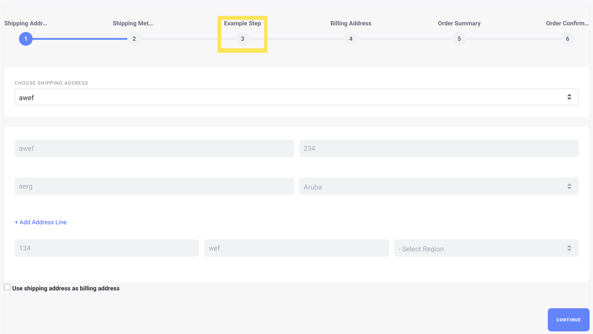

# Implementing a Custom Checkout Step

This tutorial will show you how to add a custom checkout step by implementing the `CommerceCheckoutStep` interface.

A checkout step represents one screen of the checkout process for a customer. Liferay Commerce provides several checkout steps out of the box, including many crucial steps like [the payment method step](https://raw.githubusercontent.com/liferay/com-liferay-commerce/7.1.x/commerce-checkout-web/src/main/java/com/liferay/commerce/checkout/web/internal/util/PaymentMethodCommerceCheckoutStep.java) and the [order confirmation step](https://raw.githubusercontent.com/liferay/com-liferay-commerce/7.1.x/commerce-checkout-web/src/main/java/com/liferay/commerce/checkout/web/internal/util/OrderConfirmationCommerceCheckoutStep.java).


## Overview

1. **Deploy an Example**
1. **Walk Through the Example**
1. **Additional Information**

## Deploy an Example

In this section, we will get an example checkout step up and running on your instance of Liferay Commerce. Follow these steps:

1. Start Liferay Commerce.

    ```bash
    docker run -it -p 8080:8080 liferay/commerce:2.0.2
    ```

1. Download and unzip the [Acme Commerce Checkout Step]() to your project directory.

    ```bash
    curl liferay-n8n6.zip
    ```

    ```bash
    unzip liferay-n8n6.zip
    ```

1. Go to `xxxx-impl`.

    ```bash
    cd n8n6-impl
    ```

1. Build and deploy the example.

    ```bash
    ./gradlew deploy -Ddeploy.docker.container.id=$(docker ps -lq)
    ```

    >Note: This command is the same as copying the deployed jars to /opt/liferay/osgi/modules on the Docker container.

1. Confirm the deployment in the Liferay Docker container console.

    ```bash
    STARTED com.acme.n8n6.internal.commerce.checkout.step_1.0.0
    ```

1. Verify that the example checkout step was added. Open your browser to `https://localhost:8080` and navigate to a catalog on any Liferay Commerce site. Add any item to the cart, and then click on the cart, and then "Checkout". In the list of steps shown on the screen, the new "Example step" will be present.



Congratulations, you've successfully built and deployed a new checkout step that implements `CommerceCheckoutStep`.

Next, let's dive deeper to learn more.

## Walk Through the Example

In this section, we will take a more in-depth review of the example we deployed. First, we will annotate the class for OSGi registration; second we will implement the `CommerceCheckoutStep` interface; and third, we will implement the rendering logic and a JSP for the new screen.

### Annotate Your Class for OSGi Registration

```java
@Component(
    immediate = true,
    property = {
        "commerce.checkout.step.name=" + N8N6CommerceCheckoutStep.NAME,
        "commerce.checkout.step.order:Integer=21"
    },
    service = CommerceCheckoutStep.class
)
public class N8N6CommerceCheckoutStep extends BaseCommerceCheckoutStep {

    public static final String NAME = "example-step";
```

> We must give the checkout step a name, which should be a unique value so that Liferay Commerce can distinguish your new step from other existing steps.
>
> The `commerce.checkout.step.order` value indicates how far into the checkout process the step will appear. For example, the [shipping method checkout step](https://raw.githubusercontent.com/liferay/com-liferay-commerce/7.1.x/commerce-checkout-web/src/main/java/com/liferay/commerce/checkout/web/internal/util/ShippingMethodCommerceCheckoutStep.java) has a value of 20; giving our checkout step a value of 21, then, will ensure that it appears immediately after the shipping method step.

### Implement the `CommerceCheckoutStep` Interface

To simplify our work in implementing this interface, we can extend a base class to give us some basic functionality to build on top of: [BaseCommerceCheckoutStep](https://raw.githubusercontent.com/liferay/com-liferay-commerce/7.1.x/commerce-api/src/main/java/com/liferay/commerce/util/BaseCommerceCheckoutStep.java).

After we extend the base class, only the following three methods are still required:

```java
public String getName();
```

```java
public void processAction(
        ActionRequest actionRequest, ActionResponse actionResponse)
    throws Exception
```

```java
public void render(
        HttpServletRequest httpServletRequest,
        HttpServletResponse httpServletResponse)
    throws Exception;
```

To better understand each of the required methods mentioned above, let's look at [N8N6CommerceCheckoutStep.java](./liferay-n8n6.zip/n8n6-impl/src/main/java/com/acme/n8n6/internal/commerce/checkout/step/N8N6CommerceCheckoutStep.java). We will review the implementation of each required method in sequence.

1. `public String getName();`

    ```java
    @Override
    public String getName() {
        return NAME;
    }
    ```

    > This method returns the name for our checkout step. This name may be a language key that corresponds to the actual name that will appear in the UI.
    >
    > Note that, for a language key to work correctly when used for this method, we will need to add it ourselves. For more information, see [Localizing Your Application](https://help.liferay.com/hc/en-us/articles/360018168251-Localizing-Your-Application).

1. `public void processAction(ActionRequest actionRequest, ActionResponse actionResponse) throws Exception;`

    ```java
    @Override
    public void processAction(
            ActionRequest actionRequest, ActionResponse actionResponse)
        throws Exception {
    }
    ```

    > This will be called to take care of any special backend processing that may be needed for your checkout step. If any backend processing is required, then the business logic will be implemented here, using information passed in through the `ActionRequest`.
    >
    > Note that, if no special processing is necessary for this step, then nothing needs to be added into this method.

1. `public void render(HttpServletRequest httpServletRequest, HttpServletResponse httpServletResponse) throws Exception;`

    ```java
    public void render(
            HttpServletRequest httpServletRequest,
            HttpServletResponse httpServletResponse)
        throws Exception {
    }
    ```

    > This will be where we add the code to render our customized screen for our checkout step.

### Create Your Checkout Step

To implement the checkout step itself, we need to add then implementation for the `processAction()` and `render()` methods, and then add a JSP to render the screen for the new step. In our simple example, we will only display some text on our custom screen, so we do not need any special backend processing in our `processAction().

`public void render(HttpServletRequest httpServletRequest, HttpServletResponse httpServletResponse) throws Exception`

```java
@Override
public void render(
        HttpServletRequest httpServletRequest,
        HttpServletResponse httpServletResponse)
    throws Exception {

    _jspRenderer.renderJSP(
        _servletContext, httpServletRequest, httpServletResponse,
        "/terms_and_conditions.jsp");
}
```

> We simply use a `JSPRenderer` to render the JSP for our (in this case, `terms_and_conditions.jsp`). We also give it a `ServletContext` parameter to give a context for where to find the JSP we have created.

For the JSP to be able to properly use the `ServletContext` to find the JSP in our module, we need to define it using the correct symbolic name for our bundle, like the following:

```java
@Reference(target = "(osgi.web.symbolicname=com.acme.n8n6.internal.commerce.checkout.step)")
private ServletContext _servletContext;
```

> The value we have set here for `osgi.web.symbolicname` matches the value for `Bundle-SymbolicName` in our bnd.bnd. These values must match for the `ServletContext` to look in the proper location for the JSP.
>
> Note that, for the `ServletContext` to be properly generated, we also need to declare a unique value for `Web-ContextPath` in our bnd.bnd. In our example, we have that set to the value `/commerce-checkout-step`. For a reference on these values, see [the bnd.bnd](./liferay-n8n6.zip/n8n6-impl/bnd.bnd) for this example.

Next, we need to define the JSP for our checkout step's screen in the UI. In our example, we are simply adding placeholder text for some generic messages; you can see the implementation at [terms_and_conditions.jsp](./liferay-n8n6.zip/n8n6-impl/src/main/resources/META-INF/resources/terms_and_conditions.jsp).

Lastly, we will need to add the language key for the name of our new checkout step. Add the key and its value to a `Language.properties` file within our module:

```
example-step=Example step
```

## Conclusion

Congratulations! You now know the basics for implementing the `CommerceCheckoutStep` interface, and have added a new checkout step to Liferay Commerce.

## Additional Information

* [Localizing Your Application](https://help.liferay.com/hc/en-us/articles/360018168251-Localizing-Your-Application)
