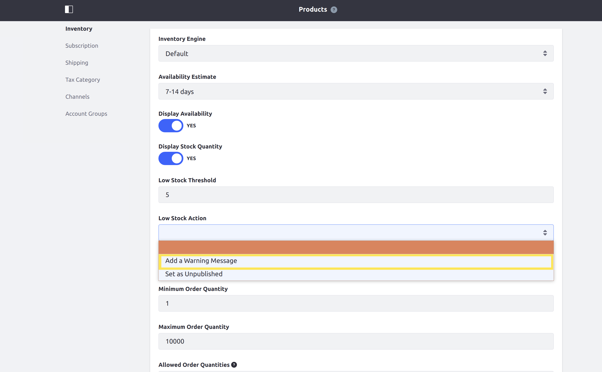

# Implementing a Custom Low Stock Activity

This tutorial will show you how to add a custom low stock activity by implementing the `CommerceLowStockActivity` interface.

Low stock activities are actions that are automatically taken if products fall below their configured Minimum Stock Quantities. Liferay Commerce provides one default low stock activity, which is to unpublish the product.


## Overview

1. **Deploy an Example**
2. **Walk Through the Example**
3. **Additional Information**

## Deploy an Example

In this section, we will get an example low stock activity up and running on your instance of Liferay Commerce. Follow these steps:

1. Start Liferay Commerce.

    ```bash
    docker run -it -p 8080:8080 liferay/commerce:2.0.3
    ```

1. Download and unzip [Acme Commerce Low Stock Activity](./liferay-j1e4.zip).

    ```bash
    curl liferay-j1e4.zip
    ```

    ```bash
    unzip liferay-j1e4.zip
    ```

1. Go to `j1e4-impl`.

    ```bash
    cd j1e4-impl
    ```

1. Build and deploy the example.

    ```bash
    ./gradlew deploy -Ddeploy.docker.container.id=$(docker ps -lq)
    ```

    >Note: This command is the same as copying the deployed jars to /opt/liferay/osgi/modules on the Docker container.

1. Confirm the deployment in the Liferay Docker container console.

    ```bash
    STARTED com.acme.j1e4.impl_1.0.0
    ```

1. Verify that the example low stock activity was added. Open your browser to `https://localhost:8080` and navigate to _Control Panel_ → _Commerce_ → _Products_. Then, for any product, click _Edit_ within its menu. If necessary, you can add a product to do this with (see [Creating a Simple Product](../../../user-guide/catalog/creating-and-managing-products/product-types/creating-a-simple-product/README.md) for help).

   From there, navigate to _Configuration_. On this screen, under the _Low Stock Action_ dropdown, the new activity ("Log a warning message") will be present.



Congratulations, you've successfully built and deployed a new low stock activity that implements `CommerceLowStockActivity`.

Next, let's dive deeper to learn more.

## Walk Through the Example

In this section, we will take a more in-depth review of the example we deployed. First, we will annotate the class for OSGi registration; second we will implement the `CommerceLowStockActivity` interface; and third, we will implement the low stock activity logic.

### Annotate the Class for OSGi Registration

```java
@Component(
    immediate = true,
    property = {
        "commerce.low.stock.activity.key=" + J1E4CommerceLowStockActivity.KEY,
        "commerce.low.stock.activity.priority:Integer=9"
    },
    service = CommerceLowStockActivity.class
)
public class J1E4CommerceLowStockActivity implements CommerceLowStockActivity {

    public static final String KEY = "Example";
```

> It is important to provide a distinct key for our low stock activity so that Liferay Commerce can distinguish the new activity from others in the [low stock activity registry](https://github.com/liferay/com-liferay-commerce/blob/2.0.3/commerce-service/src/main/java/com/liferay/commerce/internal/stock/activity/CommerceLowStockActivityRegistryImpl.java). Reusing a key that is already in use will override the existing associated activity.

### Implement the `CommerceLowStockActivity` Interface

The following three methods are required:

```java
public void execute(CPInstance cpInstance) throws PortalException;
```

```java
public String getKey();
```

```java
public String getLabel(Locale locale);
```

To better understand each of the required methods mentioned above, let's look at [J1E4CommerceLowStockActivity.java](./liferay-j1e4.zip/j1e4-impl/src/main/java/com/acme/j1e4/internal/commerce/stock/activity/J1E4CommerceLowStockActivity.java). We will review the implementation of each required method in sequence.

1. ```java
    @Override
    public void execute(CPInstance cpInstance) throws PortalException {
        // ...
    }
    ```

    > This method will be where the business logic is implemented for the custom activity.

2. ```java
    @Override
    public String getKey() {
        return KEY;
    }
    ```

    > This provides a unique identifier for the low stock activity in the registry. The key can be used to fetch the low stock activity from the registry programmatically if necessary. Reusing a key that is already in use will override the existing associated activity.

3.  ```java
    @Override
    public String getLabel(Locale locale) {
        ResourceBundle resourceBundle = ResourceBundleUtil.getBundle(
            "content.Language", locale, getClass());

        return LanguageUtil.get(resourceBundle, "add-a-warning-message");
    }
    ```

    > This returns a text label used to describe the low stock activity. `ResourceBundleUtil` is a Liferay class that provides support for multiple locales.
    >
    > Note that, for this to work correctly using `LanguageUtil`, we will need to add the language key ourselves. For more information, see [Localizing Your Application](https://help.liferay.com/hc/en-us/articles/360018168251-Localizing-Your-Application).

### Create the Low Stock Activity

To implement the low stock activity itself, we only need to add our business logic to the `execute` method of our class. In our example, we will add a warning message that is added to Liferay's logs.

```java
    @Override
    public void execute(CPInstance cpInstance) throws PortalException {
        if (_log.isWarnEnabled()) {
            _log.warn("Low stock for SKU: " + cpInstance.getSku());
        }
    }
```

> The `cpInstance` object contains information about the item with low stock, that we can use. In our example, we are using it to get the SKU for the item to add to our warning message. To find more methods you can use with a `CPInstance`, see [CPInstance](https://github.com/liferay/com-liferay-commerce/blob/2.0.3/commerce-product-api/src/main/java/com/liferay/commerce/product/model/CPInstance.java) and [CPInstanceModel](https://github.com/liferay/com-liferay-commerce/blob/2.0.3/commerce-product-api/src/main/java/com/liferay/commerce/product/model/CPInstanceModel.java).

Lastly, define the language key for our activity's label. Add the key and its value to a [Language.properties](./liferay-j1e4.zip/j1e4-impl/src/main/resources/content/Language.properties) file within our module:

```
log-a-warning-message=Log a Warning Message
```

## Conclusion

Congratulations! You now know the basics for implementing the `CommerceLowStockActivity` interface and have added a new low stock activity to Liferay Commerce.

## Additional Information

* [Creating a Simple Product](../../../user-guide/catalog/creating-and-managing-products/product-types/creating-a-simple-product/README.md)
* [Localizing Your Application](https://help.liferay.com/hc/en-us/articles/360018168251-Localizing-Your-Application)
* [Low Stock Activity](../../../user-guide/catalog/managing-inventory/low-stock-activity/README.md)
