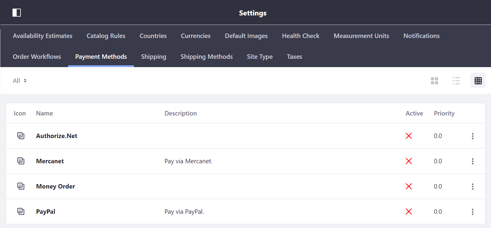

# Implementing a New Payment Method

Liferay Commerce provides several out of the box payment methods including _Authorize.Net_, _Mercanet_, _Money Order_, and _PayPal_.



This tutorial will show you how to extend Liferay Commerce by adding a Payment Method.

To add a new Payment Method:

1. Do x
2. Do y
3. Do z - Deploy
4. Test

## CommercePaymentEngine

```java
/**
 * Copyright (c) 2000-present Liferay, Inc. All rights reserved.
 *
 * This library is free software; you can redistribute it and/or modify it under
 * the terms of the GNU Lesser General Public License as published by the Free
 * Software Foundation; either version 2.1 of the License, or (at your option)
 * any later version.
 *
 * This library is distributed in the hope that it will be useful, but WITHOUT
 * ANY WARRANTY; without even the implied warranty of MERCHANTABILITY or FITNESS
 * FOR A PARTICULAR PURPOSE. See the GNU Lesser General Public License for more
 * details.
 */

package com.liferay.commerce.payment.engine;

import aQute.bnd.annotation.ProviderType;

import com.liferay.commerce.model.CommerceOrder;
import com.liferay.commerce.payment.method.CommercePaymentMethod;
import com.liferay.commerce.payment.result.CommercePaymentResult;
import com.liferay.commerce.payment.result.CommerceSubscriptionStatusResult;
import com.liferay.portal.kernel.exception.PortalException;
import com.liferay.portal.kernel.theme.ThemeDisplay;

import java.util.List;
import java.util.Locale;

import javax.servlet.http.HttpServletRequest;

/**
 * @author Luca Pellizzon
 */
@ProviderType
public interface CommercePaymentEngine {

	public CommercePaymentResult cancelPayment(
			long commerceOrderId, String transactionId,
			HttpServletRequest httpServletRequest)
		throws Exception;

	/**
	 * @param commerceOrderId
	 * @return
	 * @deprecated As of Mueller (7.2.x), this method is being moved to Subscription Engine
	 */
	@Deprecated
	public CommercePaymentResult cancelRecurringPayment(long commerceOrderId);

	public CommercePaymentResult capturePayment(
			long commerceOrderId, String transactionId,
			HttpServletRequest httpServletRequest)
		throws Exception;

	public CommercePaymentResult completePayment(
			long commerceOrderId, String transactionId,
			HttpServletRequest httpServletRequest)
		throws Exception;

	/**
	 * @param commerceOrderId
	 * @param transactionId
	 * @param httpServletRequest
	 * @return
	 * @throws Exception
	 * @deprecated As of Mueller (7.2.x), this method is being moved to Subscription Engine
	 */
	@Deprecated
	public CommercePaymentResult completeRecurringPayment(
			long commerceOrderId, String transactionId,
			HttpServletRequest httpServletRequest)
		throws Exception;

	public String getCommerceOrderPaymentMethodName(
			CommerceOrder commerceOrder, HttpServletRequest httpServletRequest,
			Locale locale)
		throws PortalException;

	public int getCommercePaymentMethodGroupRelsCount(long groupId);

	public int getCommercePaymentMethodType(long commerceOrderId)
		throws Exception;

	/**
	 * @param commerceOrderId
	 * @return
	 * @throws PortalException
	 * @deprecated As of Mueller (7.2.x), this method is being replaced
	 */
	@Deprecated
	public List<CommercePaymentMethod> getEnabledCommercePaymentMethodsForOrder(
			long commerceOrderId)
		throws PortalException;

	public List<CommercePaymentMethod> getEnabledCommercePaymentMethodsForOrder(
			long groupId, long commerceOrderId)
		throws PortalException;

	/**
	 * @param commerceOrderId
	 * @return
	 * @throws PortalException
	 * @deprecated As of Mueller (7.2.x), this method will be removed
	 */
	@Deprecated
	public int getOrderStatusUpdateMaxIntervalMinutes(long commerceOrderId)
		throws PortalException;

	public String getPaymentMethodImageURL(
			ThemeDisplay themeDisplay, String paymentMethodKey)
		throws PortalException;

	public String getPaymentMethodName(String paymentMethodKey, Locale locale);

	/**
	 * @param commerceOrderId
	 * @return
	 * @throws Exception
	 * @deprecated As of Mueller (7.2.x), this method will be removed
	 */
	@Deprecated
	public CommerceSubscriptionStatusResult getSubscriptionPaymentDetails(
			long commerceOrderId)
		throws Exception;

	public CommercePaymentResult partiallyRefundPayment(long commerceOrderId);

	public CommercePaymentResult postProcessPayment(long commerceOrderId)
		throws Exception;

	public CommercePaymentResult processPayment(
			long commerceOrderId, String nextUrl,
			HttpServletRequest httpServletRequest)
		throws Exception;

	/**
	 * @param commerceOrderId
	 * @param nextUrl
	 * @param httpServletRequest
	 * @return
	 * @throws Exception
	 * @deprecated As of Mueller (7.2.x), this method is being moved to Subscription Engine
	 */
	@Deprecated
	public CommercePaymentResult processRecurringPayment(
			long commerceOrderId, String nextUrl,
			HttpServletRequest httpServletRequest)
		throws Exception;

	public CommercePaymentResult refundPayment(
			long commerceOrderId, String transactionId,
			HttpServletRequest httpServletRequest)
		throws Exception;

	public CommercePaymentResult startPayment(
			long commerceOrderId, String checkoutStepUrl,
			HttpServletRequest httpServletRequest)
		throws Exception;

	/**
	 * @param commerceSubscriptionEntryId
	 * @return
	 * @throws Exception
	 * @deprecated As of Mueller (7.2.x), this method is being moved to Subscription Engine
	 */
	@Deprecated
	public boolean suspendSubscription(long commerceSubscriptionEntryId)
		throws Exception;

	public CommerceOrder updateOrderPaymentStatus(
			long commerceOrderId, int paymentStatus, String transactionId)
		throws PortalException;

	public CommercePaymentResult voidTransaction(
			long commerceOrderId, String transactionId,
			HttpServletRequest httpServletRequest)
		throws Exception;

}
```

## Extending CommercePaymentEngine

An example of extending `CommercePaymentEngine` can seen in `MoneyOrderCommercePaymentMethod.java`.

```java
/**
 * Copyright (c) 2000-present Liferay, Inc. All rights reserved.
 *
 * This library is free software; you can redistribute it and/or modify it under
 * the terms of the GNU Lesser General Public License as published by the Free
 * Software Foundation; either version 2.1 of the License, or (at your option)
 * any later version.
 *
 * This library is distributed in the hope that it will be useful, but WITHOUT
 * ANY WARRANTY; without even the implied warranty of MERCHANTABILITY or FITNESS
 * FOR A PARTICULAR PURPOSE. See the GNU Lesser General Public License for more
 * details.
 */

package com.liferay.commerce.payment.method.money.order.internal;

import com.liferay.commerce.constants.CommerceOrderConstants;
import com.liferay.commerce.constants.CommercePaymentConstants;
import com.liferay.commerce.payment.method.CommercePaymentMethod;
import com.liferay.commerce.payment.request.CommercePaymentRequest;
import com.liferay.commerce.payment.result.CommercePaymentResult;
import com.liferay.portal.kernel.language.LanguageUtil;
import com.liferay.portal.kernel.util.ResourceBundleUtil;

import java.util.Collections;
import java.util.Locale;
import java.util.ResourceBundle;

import org.osgi.service.component.annotations.Component;

/**
 * @author Luca Pellizzon
 */
@Component(
	immediate = true,
	property = "commerce.payment.engine.method.key=" + MoneyOrderCommercePaymentMethod.KEY,
	service = CommercePaymentMethod.class
)
public class MoneyOrderCommercePaymentMethod implements CommercePaymentMethod {

	public static final String KEY = "money-order";

	@Override
	public CommercePaymentResult completePayment(
			CommercePaymentRequest commercePaymentRequest)
		throws Exception {

		return new CommercePaymentResult(
			null, commercePaymentRequest.getCommerceOrderId(),
			CommerceOrderConstants.PAYMENT_STATUS_PAID, false, null, null,
			Collections.emptyList(), true);
	}

	@Override
	public String getDescription(Locale locale) {
		return null;
	}

	@Override
	public String getKey() {
		return KEY;
	}

	@Override
	public String getName(Locale locale) {
		ResourceBundle resourceBundle = _getResourceBundle(locale);

		return LanguageUtil.get(resourceBundle, KEY);
	}

	@Override
	public int getPaymentType() {
		return CommercePaymentConstants.COMMERCE_PAYMENT_METHOD_TYPE_OFFLINE;
	}

	@Override
	public String getServletPath() {
		return null;
	}

	@Override
	public boolean isCompleteEnabled() {
		return true;
	}

	@Override
	public boolean isProcessPaymentEnabled() {
		return true;
	}

	@Override
	public CommercePaymentResult processPayment(
			CommercePaymentRequest commercePaymentRequest)
		throws Exception {

		return new CommercePaymentResult(
			null, commercePaymentRequest.getCommerceOrderId(),
			CommerceOrderConstants.PAYMENT_STATUS_AUTHORIZED, false, null, null,
			Collections.emptyList(), true);
	}

	private ResourceBundle _getResourceBundle(Locale locale) {
		return ResourceBundleUtil.getBundle(
			"content.Language", locale, getClass());
	}

}
```

## Try it out

1. Start your dev environment
2. Get the sample
3. Deploy the sample
4. See the change
