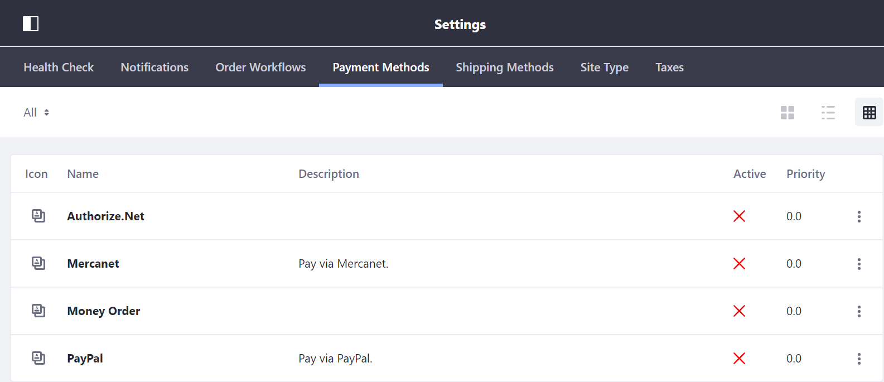
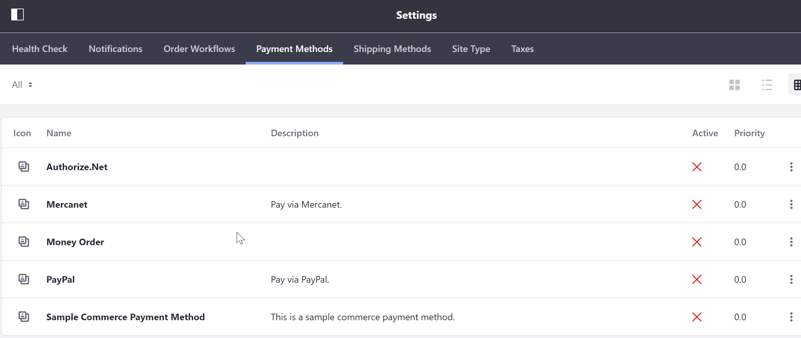

# Implementing a New Basic Payment Method

Liferay Commerce provides several out of the box payment methods including _Authorize.Net_, _Mercanet_, _Money Order_, and _PayPal_.



This tutorial will introduce you to implementing the `CommercePaymentMethod` interface by adding a new basic payment method.

## Roadmap

* Deploy the Sample
* Walkthrough
* Additional Information

### Deploy the Sample

1. Start Liferay Commerce.

    ```bash
    docker run -it -p 8080:8080 liferay/commerce:2.0.1
    ```

1. Download and unzip the [Acme Commerce Payment Method Sample]() to your project directory.

    ```bash
    curl liferay-b1c3.zip
    ```

    ```bash
    unzip liferay-b1c3.zip
    ```

1. Go to `/b1c3-impl/`.

    ```bash
    cd b1c3-impl/
    ```

1. Build and deploy the sample.

    ```bash
    ./gradlew deploy -DdockerContainerId=$(docker ps -lq)
    ```

    >Note: This command is the same as copying the deployed jars to /opt/liferay/osgi/modules on the Docker container.

1. Confirm the deployment in the Liferay Docker container console.

    ```bash
    STARTED com.acme.b1c3.internal.commerce.payment.method_1.0.0
    ```

1. Validate in Liferay Commerce | Open browser to `https://localhost:8080` and navigate to Payment Methods.



Congratulations, you've successfully built and deployed a new basic payment method that implements `CommercePaymentMethod`. Now, let's dive deeper.

### Walkthrough

First implement the following required methods for `com.liferay.commerce.payment.method.CommercePaymentMethod`:

```java
	public String getDescription(Locale locale);

	public String getKey();

	public String getName(Locale locale);

	public int getPaymentType();

	public String getServletPath();
```

#### Understanding the Required Methods

To learn more about `com.liferay.commerce.payment.method.CommercePaymentMethod`, let's look at the sample we just deployed:

[`B1C3CommercePaymentMethod.java`](.\liferay-b1c3.zip\b1c3-impl\src\main\java\com\acme\b1c3\internal\commerce\payment\method\B1C3CommercePaymentMethod.java)

```java
	@Override
	public String getDescription(Locale locale) {
		ResourceBundle resourceBundle = ResourceBundleUtil.getBundle("content.Language", locale, getClass());

		return LanguageUtil.get(resourceBundle, "b1c3-commerce-payment-method-description");
	}
```

>Populates the "Description" column in the Payment Methods administration page. `ResourceBundleUtil` is a Liferay class that provides support for multiple locales. Visit [Supporting Multiple Locales on Liferay]() for more information.

<br>

```java
	@Override
	public String getKey() {
		return "b1c3-commerce-payment-method-registry-key";
	}
```

>A unique identifier for the payment method. Reusing a key that is already in use will override the existing associated method. In the registry, this key will be associated with the payment method. The key can be used to fetch the payment method from the registry programmatically if necessary.

<br>

```java
	@Override
	public String getName(Locale locale) {
		ResourceBundle resourceBundle = ResourceBundleUtil.getBundle("content.Language", locale, getClass());

		return LanguageUtil.get(resourceBundle, "b1c3-commerce-payment-method-name");
	}
```

>Populates the "Name" column in the Payment Methods Administration Page.`ResourceBundleUtil` is a Liferay class that provides support for multiple locales. Visit [Supporting Multiple Locales on Liferay]() for more information.

<br>

```java
	@Override
	public int getPaymentType() {
		return CommercePaymentConstants.COMMERCE_PAYMENT_METHOD_TYPE_OFFLINE;
	}
```

>Payment Type identifies the way in which the Payment Engine will use a given Payment Method. `COMMERCE_PAYMENT_METHOD_TYPE_OFFLINE` informs the payment engine that there are no online processing requirements for this Payment Method. There are two other payment type constants available out of the box: `COMMERCE_PAYMENT_METHOD_TYPE_ONLINE_STANDARD` and `COMMERCE_PAYMENT_METHOD_TYPE_ONLINE_REDIRECT`. For more information see [Implementing a New Online Payment Method]().

<br>

```java
	@Override
	public String getServletPath() {
		return null;
	}
```

>When implementing an online payment method, a servlet may be required to enable proper interfacing with an external payment provider. Since no servlet path is required for an offline payment method, `getServletPath` can return `null`.

#### Implement Optional Methods

The following optional methods should be implemented. There are many more methods that can be implemented that provide additional functionality. These methods come in pairs: one method to enable and the other to implement a given piece of functionality.

```java
	@Override
	public CommercePaymentResult completePayment(
			CommercePaymentRequest commercePaymentRequest)
		throws Exception {

		return new CommercePaymentResult(
			null, commercePaymentRequest.getCommerceOrderId(),
			CommerceOrderConstants.PAYMENT_STATUS_PAID, false, null, null,
			Collections.emptyList(), true);
	}
```

>Short description

<br>

```java
	@Override
	public boolean isCompleteEnabled() {
		return true;
	}
```

>Short description

<br>

```java
	@Override
	public boolean isProcessPaymentEnabled() {
		return true;
	}
```

>Short description

<br>

```java
	@Override
	public CommercePaymentResult processPayment(
			CommercePaymentRequest commercePaymentRequest)
		throws Exception {

		return new CommercePaymentResult(
			null, commercePaymentRequest.getCommerceOrderId(),
			CommerceOrderConstants.PAYMENT_STATUS_AUTHORIZED, false, null, null,
			Collections.emptyList(), true);
	}
```

>Short description

#### Annotate Your Class for OSGI Registration

```java
@Component(
	immediate = true,
	property = "commerce.payment.engine.method.key=" + B1C3CommercePaymentMethod.KEY,
	service = CommercePaymentMethod.class
)
public class B1C3CommercePaymentMethod implements CommercePaymentMethod {
```

### Putting it Together

View the full sample class: [B1C3CommercePaymentMethod.java](.\liferay-b1c3.zip\b1c3-impl\src\main\java\com\acme\b1c3\internal\commerce\payment\method\B1C3CommercePaymentMethod.java).

## Summary

Congratulations! You now know the basics for implementing the `CommercePaymentMethod` interface and have added a new basic payment method to Liferay Commerce.

## Additional Information

* [Supporting Multiple Locales on Liferay]()
* [Implementing a New Online Payment Method]()
