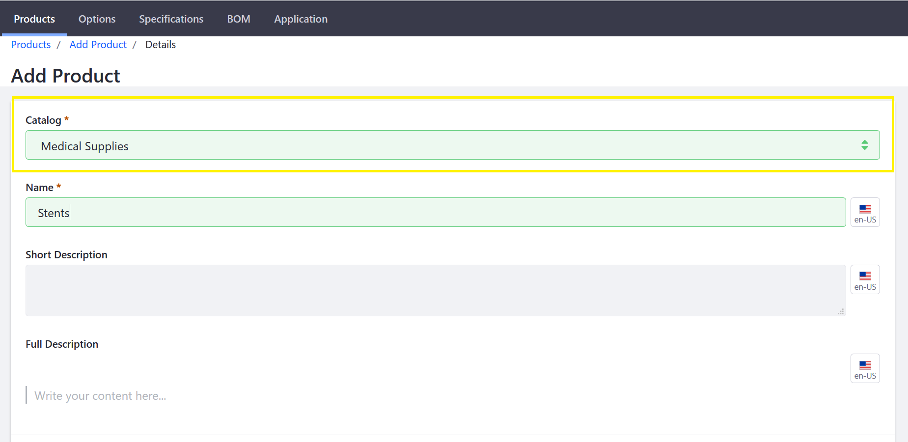

# Creating a New Catalog

A catalog is the complete list of related products which are then associated with [channels](../creating-and-managing-products/channels/introduction-to-channels/README.md). Liferay Commerce allows multiple catalogs.

To create a new catalog:

1. Navigate to _Control Panel_ → _Commerce_ → _Catalogs_.
1. Click the (+) button to add a new catalog.
1. Enter the following:
    * **Name**: Medical Supplies
    * **Default Catalog Language**: (your Language) (for example, _English (United States)_)
    * **Currency**: (your store's currency) (_US Dollar_)

1. Click _Save_.

The new catalog has been created. Once the catalog has been created, it is available as an option when entering a new product.

## Additional Information

* Locale Options
* [Adding a New Currency](../../getting-started/currencies/adding-a-new-currency/README.md)
