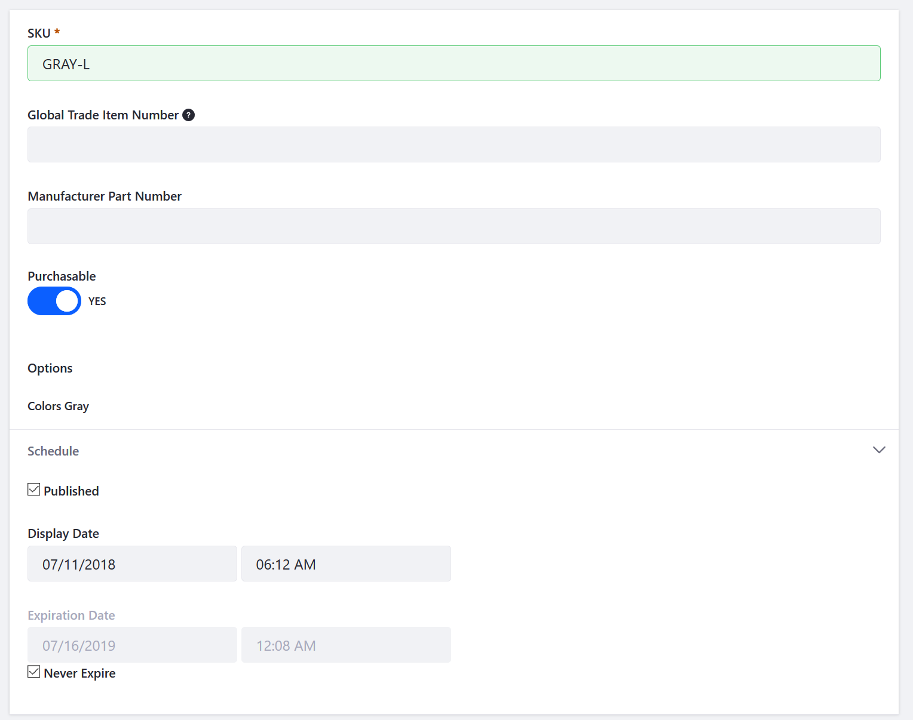

# Adding SKUs to Your Products

SKUs (an abbreviation for Stock Keeping Units) provide a convenient way to inventory and price multiple product variants stored in multiple warehouses. This article describes how to add SKUs to your products. Liferay Commerce has a feature which can generate automatically SKUs once Products and Product Options have been created in the catalog as well as generating SKUs manually.

## Prerequisites

In order to auto-generate SKUs, the following must be completed:

* Product options templates have been created. (See [Customizing Your Product with Product Options](https://github.com/liferay/liferay-help/blob/master/commerce/user-guide/catalog/creating-and-managing-products/customizing-your-product/README.md))
* Product options have been applied to your product(s). See [Customizing Your Product with Product Options](https://github.com/liferay/liferay-help/blob/master/commerce/user-guide/catalog/creating-and-managing-products/customizing-your-product/README.md)

## Generating All SKU Combinations (Automatic)

The fastest and easiest way to add SKUs to your products is use the _Generate All SKU Combinations_ feature.

It’s highly recommended all the product options (templates and values) be finalized for your product before using the Generate All SKU Combinations feature.

Once your product options are created, here’s how to quickly and easily generate SKUs for all the combinations of product variants:

1. Navigate to the _Control Panel_ → _Commerce_ → _Products_.
1. Click on a product (_Torque Converters_ in this example).
1. Click the _SKUs_ tab.
1. Click the (+) button.
1. Click Generate All SKU Combinations.

     

The SKUs for Black and Gray Product Options have been generated. Repeat the steps to generate more SKU combinations.

## Adding a SKU (Manual)

Adding (or modifying) a SKU to a product manually could be useful if you already have SKUs for your products. You can add one or more additional products to your catalog but at the same time avoid having to reset or change your existing SKUs.

To add or modify a SKU to a product:

1. Navigate to the _Control Panel_ → _Commerce_ → _Products_.
1. Click on a product (_Torque Converters_ in this example).
1. Click the _SKUs_ tab.
1. Click on a SKU (_GRAY_ in this example).
1. Rename the SKU: _GRAY-L_.
1. Leave the Purchasable toggle set to YES.

	

1. Click _Publish_.

The SKU has successfully been renamed.
