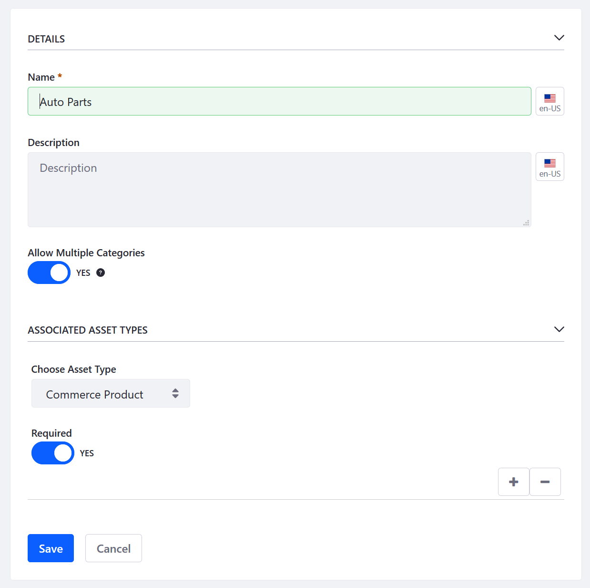
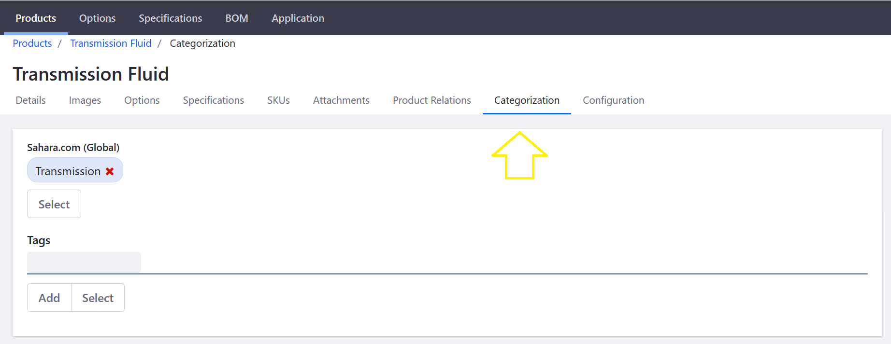

# Product Categories

Products can be organized into Categories. These groupings allow multiple products to be grouped and handled collectively. Product categories can be used to apply discounts or other offers to a set of products, to assist buyers in finding products, or to promote certain products to a specified account or account group.

Categories may also be organized hierarchically to form a taxonomy of categories. To organize products into categories, you must create the categories first and then assign products to them. Furthermore, because all Liferay Commerce Products are handled at the global level, all Vocabularies and Categories have to be at the global scope level.

> (What is scope? What is the global scope level?) (Cross reference placeholder)

## Creating Categories

As noted above, creating the taxonomy must be done at the Global scope level.

Navigate to the _Control Panel_ →  _Go to Other Site_ → _My Sites_ → _Global_. Once on the _Global_ site, click _Categorization_ → _Categories_.

All Categories require a Vocabulary which is the parent container. [Create a Vocabulary _first_](LINK-TO-CROSS-REFERENCE) before creating Categories. Click the (+) button to create a Vocabulary.

| Field | Description |
| ------ | ------- |
| Name | Name of the Vocabulary |
| Description | Description of the Vocabulary |
| Allow Multiple Categories | Toggle to allow one-to-one or one-to-many relationship |
| Choose Asset Type| List of all Asset Types in Liferay DXP which includes _Commerce Product_ |
| Required | Toggle to control whether all Commerce Products must have an associated Category |

Once a Vocabulary has been created, create the associated categories. Click the Vocabulary then click the (+) button.

If _Allow Multiple Categories_ has been enabled for the vocabulary, you may create as many categories as necessary.

## Managing Product Categories

Once you have created your taxonomy using your Vocabulary and Categories, you can start adding categories to the products in the catalog.

Navigate to the _Control Panel_ → _Commerce_ → _Products_. Click on a product then the _Categorization_ tab. (If you used Minium to create a site with sample data, click _Transmission Fluid_. Note that the _Transmission Fluid_ product already has been linked to the sample Vocabulary and Category.)

Click on the _Select_ button under the label for the appropriate vocabulary, and in the pop-up that appears the check the box next to each category that applies.

## Additional Information

**Note 1**: If you used an accelerator like Minium to create your site with sample data, the Vocabulary and Categories are populated in the Global scope. This means all the sample categories are available in all sites.

**Note 2**: Categories nest hierarchically. While this allows multiple categories to be grouped together and handled as a single unit, it also can makes it difficult for administrators to view the entire vocabulary. It is possible to view all categories at once. To do so, navigate to the _Control Panel_ → _Configuration_ → _System Settings_ → _Assets_ and select _Flattened Tree_ from the drop-down menu in _Asset Categories Web_.

Click _Save_ to apply the changes. You can always change it back to the default view later.

See [Creating a New Product Category](../creating-a-new-product-category/README.md) to start organizing your products.
