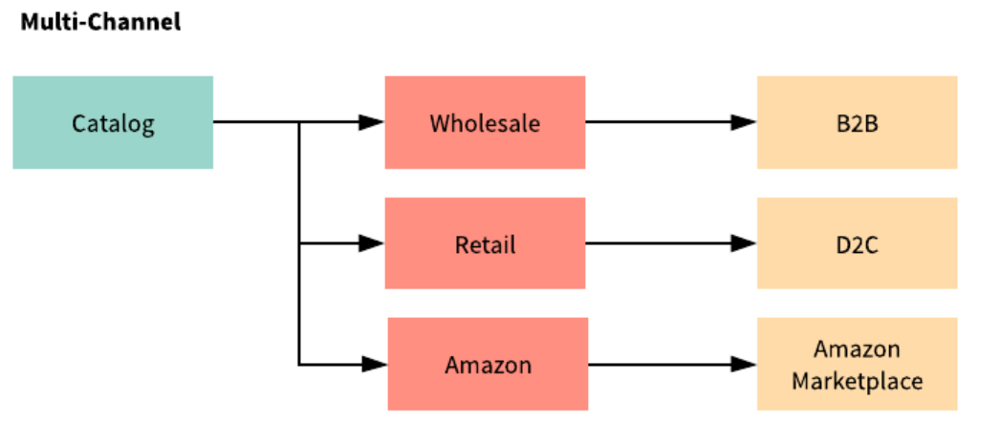

# Introduction to Channels

Liferay Commerce provides tools to enable a variety of store models - from simple B2C stores using a single catalog making sales solely through a single site to complex multi-region, multi-market, and multi-medium scenarios. Liferay Commerce enables a wide array of use cases by leveraging the power of Channels.

>A simple commerce store example.

In Liferay Commerce, the Channels concept represents any place where products can be sold; a Liferay Commerce based storefront, a third party marketplace (Amazon), or even direct back office phone sales. Each represents a channel by which a vendor can sell and deliver products to customers and - with Channels - store administrators can deliver targeted product lines and marketing experiences.

>A more complex use case using multiple Channels.

Channels are also the primary method by which store administrators may configure product visibility across their stores. Out of the box, channels are assigned in a 1:1 relationship with sites. This enables administrators to manage their catalog(s), while administering multiple channels and offering full control over the distribution of products to any given channel.

>Product level configurations to scope product visibility to specific Channels.

## Additional Information
