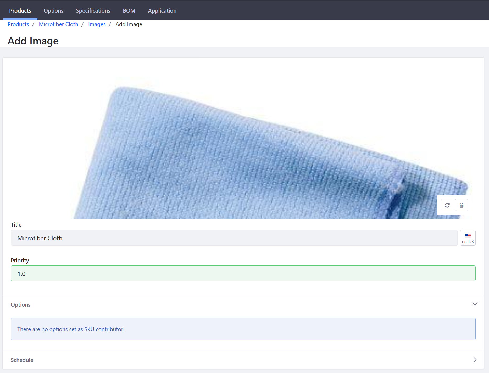
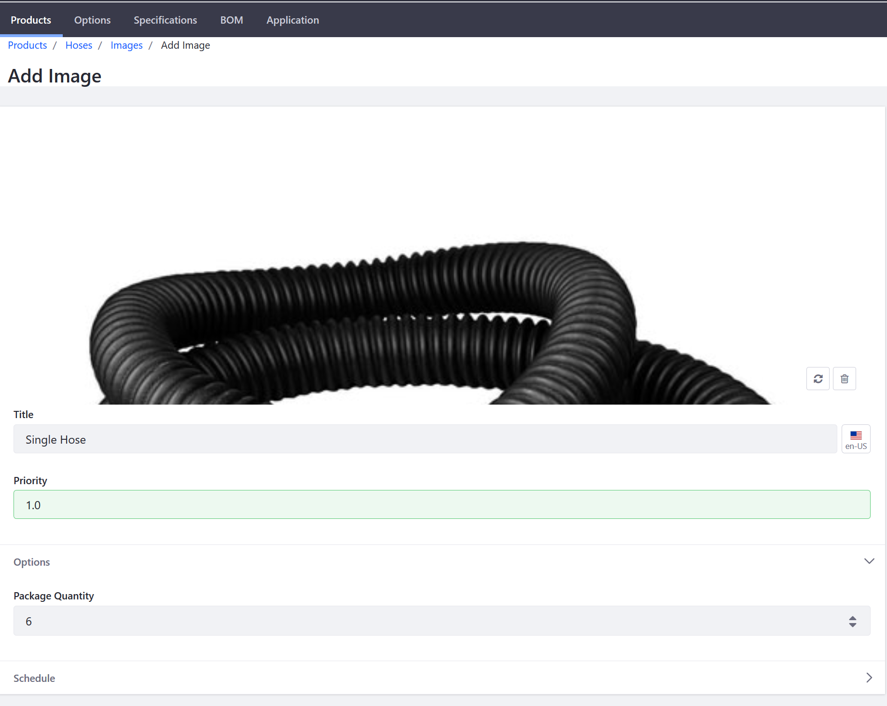
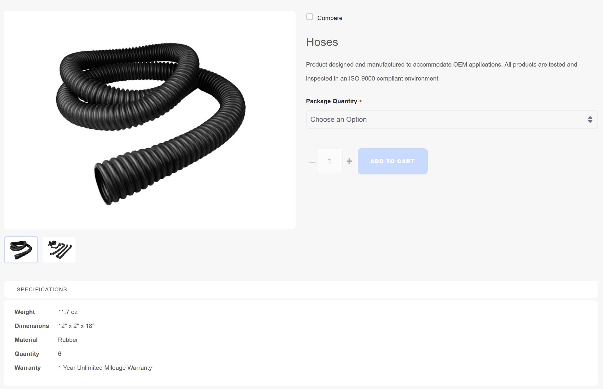

# Product Images

Product images help to ensure that customers know what they are buying and increase the likelihood of a sale. Store administrators can upload images for each product variant (different SKUs).

This article documents how to add images to a product.

## Roadmap

1. [Adding a single product image.](#adding-a-single-product-image)
2. [Adding multiple product images.](#adding-multiple-product-images)

## Adding a Single Product Image

1. Navigate to  _Control Panel_ → _Commerce_ → _Products_.
1. Click on a product (in this example, _Microfiber Cloth_).
1. Click the _Images_ sub-tab.
1. Click the (+) button to add a product image.
1. Drag and drop an image or click _Select File_ to upload an image.
1. Enter a title: _Microfiber Cloth_.
1. Set a priority: _1.0_.

    

1. Click _Publish_.

The new product image has been added to the product. Note that under _Options_, the message "`There are no options set as the SKU contributor.`" may appear. If this message appears, then the product does not have additional associated SKUs and the image added is the only one associated with the product. See the section below on how to associate multiple product images to product variants.

To view the image in the catalog, go to the store site and then search for the product (_Microfiber Cloth_).

## Adding Multiple Product Images

As noted above, multiple product images can be associated with a single product.

### Prerequisites

1. [Product Options](../../customizing-your-product-with-product-options/README.md) have been created for this product.
2. [Multiple SKUs](../../adding-skus-to-your-products/README.md) have been generated for this product.

Once you have created Product Options and generated the corresponding SKUs, you can then associate different product images. To add multiple images to the different SKUs:

1. Navigate to _Control Panel_ → _Commerce_ → _Products_.
2. Click on a product, in this example, _Hoses_.
    >If you had used Minium to create your store and sample data, this product was added by the Minium accelerator.
3. Click the _Images_ sub-tab.
4. Click the (+) button to add a product image.
5. Drag and drop an image or click _Select File_ to insert an image.
6. Click on the existing image.
7. Select _6_ under the _Package Quantity_ drop down.

    

8. Click _Publish_.

The product image has been updated with the respective Product Option. Repeat these steps as desired for all other available SKUs, such as another package quantity. In this example, different images may be used for the different package quantities. When searching for a product, you can see that all images have been included inside the Product Detail widget.

## Additional Information

**Note**: To configure a default placeholder image for products that do not have an image uploaded, see Setting a Default Catalog Image.
