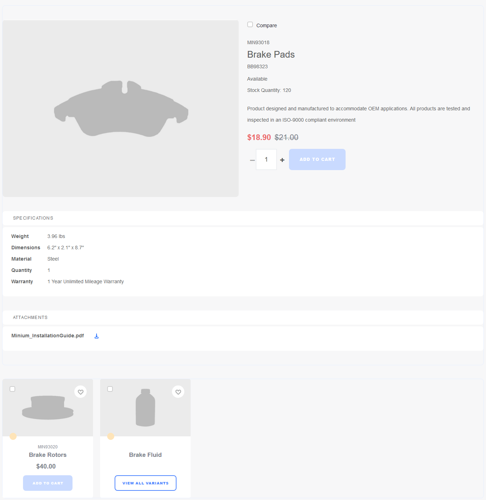
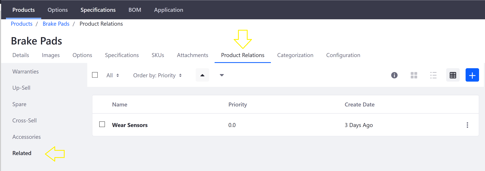
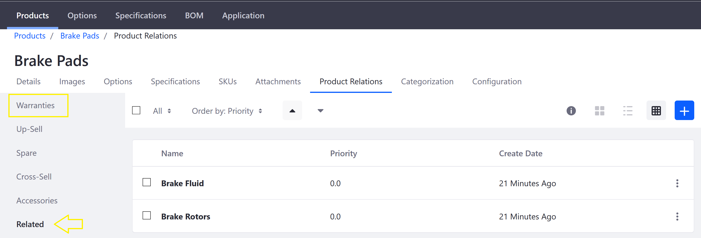

# Related Products, Up-sells, and Cross-Sells

Product relations can be used to connect products. Once connected, a product displays the links to other products. Every related product must be assigned to a Product Relation Type. These products can then be displayed by a Product Publisher widget configured to source data from the appropriate type.

By placing more than one Product Publisher widget on a product detail page, you can list multiple sets of related products. For instance, one widget might display a set of products that are alternatives to the product featured on the page, while another might display products that are accessories to the featured product.

Note: If your site was built from an accelerator, then a number of product relation types are already in place. Here is a list of default Product Relations:

* **Up-sell**: Display products that are comparable to the featured product but have a higher sale value.
* **Spare**: Display products that are spare parts or components for the featured product.
* **Related**: A catch-all set.
* **Accessories**: Display add-on products for use in conjunction with the featured products.
* **Cross-sell**: Display products complementary to the featured product.

    

In the image above, the two related products are displayed in the Product Publisher widget at the bottom. You have the option to add more Product Publisher widgets configured with other types of Product Relations.

## Adding a New Product Relation Type

Besides those five sample Product Relations, there is an option to add more relationships. This includes intangibles such as warranties. To add a new Product Relation:

1. Navigate to the _Control Panel_ → _Configuration_ → _System Settings_.
1. Click _Catalog_ in the _Commerce_ section.
1. Click _Product Relations_ on the left menu.
1. Click the _Add_ button.
1. Enter the new Product Relation in the _Type_ field: Warranties.
1. Click _Save_. 

    

The new Product Relation entry has been added. 

## Creating Relationships Between Products

1. Navigate to the _Control Panel_ → _Commerce_ → _Products_.
1. Select any product; for example, _Brake Pads_. (This was created using the Minium Accelerator.)
1. Click on the _Product Relations_ sub-tab.
1. Click on _Related_ in the left menu.

    

1. Click the (+) button to add one or more relationships. In this example, select _Brake Rotors_ and _Brake Fluid_.
1. Click _Add_.

    

These two products are now associated with _Brake Pads_. Note that this relationship is not reciprocal; in other words, on the _Brake Rotors_ Product Relations tab, you will not see _Brake Pads_. Store administrators will have to recreate the relationship for _Brake Rotors_.

Once the product relationships have been created, configure the Product Publisher widget to display the relations.

## Displaying Product Relations

You can display product relations on a product display page by configuring a Product Publisher widget. You must have a [product display page](https://help.liferay.com/hc/en-us/articles/360017870292-Displaying-Product-Pages-) in place first.

1. On your store site, search for the product (for example _Brake Pads_).
1. Click the _3-dot_ icon (Options) → _Configuration_.
1. Select _Product Relations related_ from the _Data Source_ dropdown menu.

    

1. Click _Save_ and close the dialog box.

    

The example above shows how different products could be related, ensuring that customers can see the full range of products that may also be potentially useful.