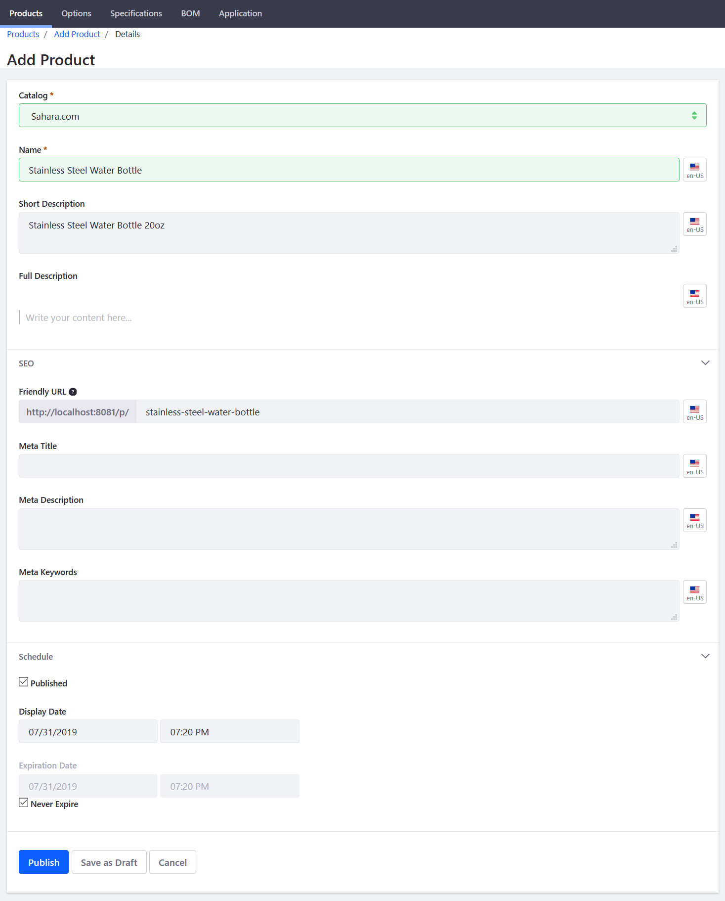

# Creating a Simple Product

This article documents how to create a Simple Product in the catalog. A Simple Product is any physical product for which inventory is tracked. Almost any physical item can be a Simple Product.

## Roadmap

* Initial Creation
* Additional Required Configurations
* Final Configurations 

To create a Simple Product:

1. Navigate to _Control Panel_ → _Commerce_ → _Products_. 
1. Click the (+) button then _Simple_.
1. Enter the following:
   * **Catalog**: Sahara.com
   * **Name**: Water Bottle
   * **Short Description**: Stainless steel water bottle 20oz.
   * **Full Description**: 
   * **Friendly URL**: (autogenerated)
   * **Meta Title**:
   * **Meta Description**:
   * **Meta Keywords**:

    

1. Click _Publish_.

Once the product has been added, follow the next series of steps to finish configuring the product.

## Additional Required Configurations

### Applying Product Options

[Product Options](../../customizing-your-product-with-product-options/README.md) provide an easy and flexible way to offer products that have a variety of options such as size, quantity, and color. Click the _Options_ sub-tab to continue.

### SKUs and Setting Prices and Quantities

Once you have applied product options to the product, SKUs have to be generated. For more information about how to generate SKUs, see the article [Adding SKUs to Your Products](../../adding-skus-to-your-products/README.md). After the SKUs have been generated, set the base price and quantities for each item. 

In this example, one product is a package of 6 water bottles (SKU is called 6). 

   

1. Click the _3-dot_ icon then _Edit_ next to _6_. (At this point, you can rename the SKU to something more descriptive like _6 Pack_ on the _Details_ menu.)
1. Click _Pricing_ on the left menu.
1. Enter the following:
    * **Price**: 12.00
    * **Promo Price**:
    * **Cost**: 
1. Click _Save_. (If Promo Price and Cost fields are left as 00, no discounts or promotions are applied at this point.)
1. Click _Price List_ to apply this product to any existing [Price Lists](../../../managing-price/price-lists/adding-products-to-a-price-list/README.md).
1. Click _Inventory_ on the left menu.
1. Enter a quantity for the corresponding warehouses.

    

1. Repeat these steps for the all the other product variants (SKUs) associated with this product.    

These are the required mininum steps to create a basic product to be made available and sold in the catalog. 

## Final Configurations

Lastly, add any [product specifications](../../product-information/specifications/README.md), [product images](../../product-information/product-images/README.md), attachments, [tags and categories](../../categories/creating-a-new-product-category/README.md), and create any [product relations](../../product-information/product-relations/README.md). These pieces of information are helpful in describing the product. These pieces of information are also applicable when creating the other product types (grouped and virtual).

## Additional Information

* [Introduction to Product Types](../introduction-to-product-types/README.md)
* [Creating a Grouped Product](../creating-a-grouped-product/README.md)
* [Creating a Virtual Product](../creating-a-virtual-product/README.md) 