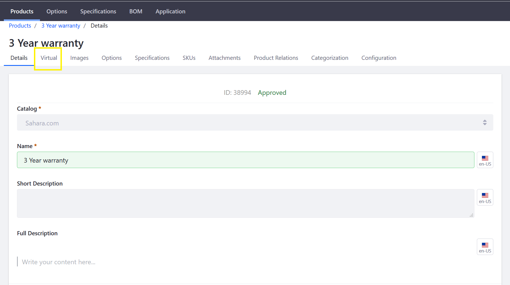

# Creating a Virtual Product

A virtual product is any non-physical product. For example, the product is downloaded rather than shipped: a music file, a video, or an electronic publication. Virtual products could also include warranties and service contracts.

Note that when creating a Virtual Product in Liferay Commerce, there is an extra tab (_Virtual_) in its product tab bar which contains necessary configurations.

To create a Virtual Product:

1. Navigate to _Control Panel_ → _Commerce_ → _Products_.
1. Click the (+) button then _Virtual_.
1. Enter the following:
    * **Catalog**: Sahara.com
    * **Name**: 3 Year Warranty
    * **Short Description**: 3 Year Warranty
    * **Full Description**: 3 Year Warranty for all products purchased on Sahara.com
    * **Friendly URL**: (auto-generated)
    * **Meta Title**: 3 year Warranty
    * **Meta Description**: 3 year Warranty for all products
    * **Meta Keywords**: warranty, goods, year
1. Click _Publish_.

Once this virtual product has been created initially, there are additional required configurations. Click the _Virtual_ sub-tab to continue.

   

1. Enter the following:
    * **Insert the URL or select a file of your virtual product.**: Upload warranty.pdf
    * **Activation Status**: Completed
    * **Duration**: 0
    * **Max Number of Downloads**: 0
    * **Enable Sample**: unchecked
    * **Enable Terms of Use**: No

    

1. Click _Save_.

See the table below for more a detailed explanation of each field.

## Virtual Product Reference

|Field | Description |
| --- | --- |
| URL | Insert the URL where the file is located. |
| Select File | Alternatively, upload the file that will be stored in the Liferay Commerce repository. |
| Activation Status | Status of the order |
| Duration | The number of days during which customers keep access to the file. Leave 0 for unlimited downloads. Please note: if product is subscription enabled, the subscription cycles duration will override it. |
| Max Number of Downloads | Number of times a file can be downloaded. Leave 0 for unlimited downloads. |
| Enable Sample | Checkbox to activate or deactivate the availability of a sample. |
| Sample File URL | If _Enable Sample_ is active, this is the location of the Sample. |
| Enable Terms of Use | Toggle to enable whether user must agree to Terms of Use; if enabled, either enter the terms of use directly in the text field or link to an existing Web Content article. |

Lastly, follow the rest of the steps found in [Creating a Simple Product](../creating-a-simple-product/README.md), such as adding SKUs and setting a base price. These are required when adding a Virtual Product to the catalog.

## Additional Information

* [Introduction to Product Types](../introduction-to-product-types/README.md)
* [Creating a Grouped Product](../creating-a-grouped-product/README.md)
* [Creating a Simple Product](../creating-a-simple-product/README.md)