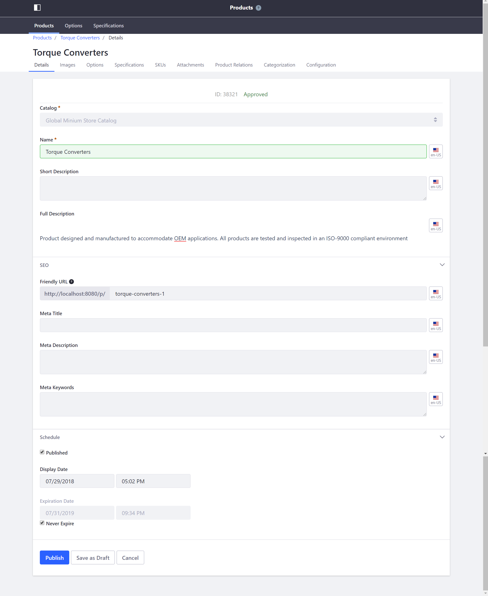

# Introduction to Product Types

The catalog supports three product types: Simple, Grouped, and Virtual.

**[Simple Product](../creating-a-simple-product/README.md)**: Any physical product for which inventory is tracked.

**[Grouped Product](../creating-a-grouped-product/README.md)**: Two or more products from the catalog, packaged together to be sold as a single item. Grouped products are tracked in inventory. A grouped product can contain Simple Products, other Grouped Products, or Virtual Products.

**[Virtual Products](../creating-a-virtual-product/README.md)**: A virtual product is **downloadable** product or has a set duration. Examples include music files, electronic publications, services, and warranties. Otherwise, use a Simple product type.

Each product type can have a different renderer so that they can be displayed uniquely in the Product Details widget.

## Product Detail Reference

| Field | Description |
| --- | --- |
| Catalog | Catalog associated with the product - this association is permanent |
| Name | Product Name |
| Short Description | Short summary of the product |
| Full Description | Longer description of the product |

### SEO

| Field | Description |
| --- | --- |
| Friendly URL | The URL for the product page |
| Meta Title |  Product title to help search engines locate your products |
| Meta Description | Product description used by search engines |
| Meta Keyword | Keywords used by search engines |

### Schedule

| Field | Description |
| --- | --- |
| Published | Checkbox to enable the product's visibility and availability for sale in the catalog |
| Display Date | Date the product is first made available for sale in the Catalog |
| Expiration Date | Determines when the product will no longer be available, if _Never Expire_ is unchecked |
| Never Expire | Determines if a product can be scheduled for expiration |

## Additional Information

* [Creating a Simple Product](../creating-a-simple-product/README.md)
* [Creating a Grouped Product](../creating-a-grouped-product/README.md)
* [Creating a Virtual Product](../creating-a-virtual-product/README.md)
* [Virtual Product Reference](../virtual-product-reference/README.md)
* [Adding a New Product Type](../../../../../developer-guide/tutorial/adding-a-new-product-type/README.md)
