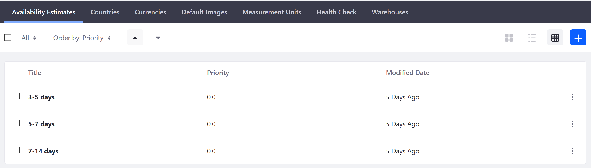
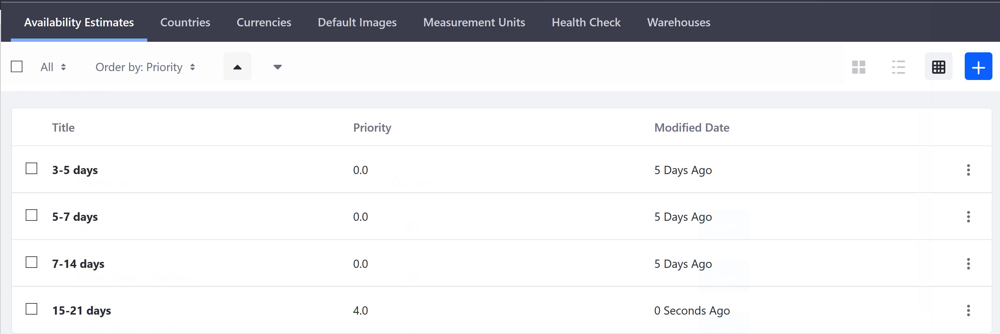

# Availability Estimates

This article documents how to configure Availablity Estimates. If a product becomes unavailable, store owners can inform customers how long before a product is availablea again. There are three default time periods in Liferay Commerce.

To manage the Availability Estimates:

1. Navigate to the _Control Panel_ → _Commerce_ → _Settings_.
1. Click the _Availability Estimates_ tab.
1. Click the (+) button to add a new estimate.
1. Enter the following:
    * Title: 15-21 days
    * Priority: 4.0
1. Click _Save_.

The new Availability Estimate has been added.

This will display in the _Product Configuration_ → _Inventory_ menu.

## Additional Information

* [Introduction to Managing Inventory](../introduction-to-managing-inventory/README.md)
* [Inventory Reference Guide](../inventory-reference-guide/README.md)