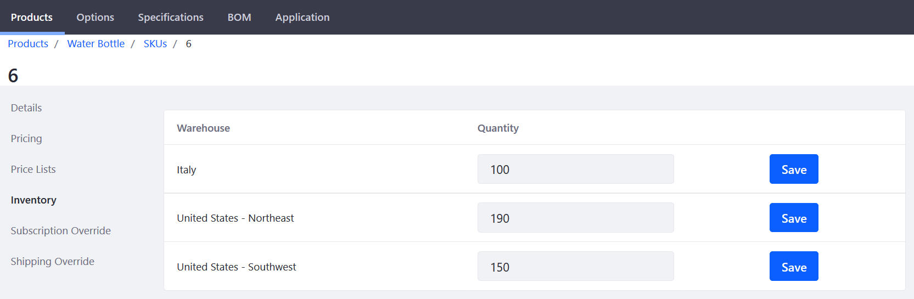

# Setting Inventory by Warehouses

This article documents how to set inventory by warehouses. Some stores may have more than one warehouse and store managers can set the quantity for each location. The _Inventory_ menu is where store administrators manage the number of products available for sale in each warehouse. If you had used the [Minium Accelerator](../../../getting-started/accelerators/using-the-minium-accelerator-to-jump-start-your-b2b-store/README.md) to create the store with sample data, there are three warehouses already created.

To set inventory by warehouses:

1. Navigate to the _Control Panel_ → _Commerce_ → _Products_.
1. Click on a product (for example _U-Joint_).
1. Click the _SKUs_ sub-tab.
1. Click on the product ID (_MIN-55861_).
1. Click _Inventory_ on the left menu.
1. Enter a quantity for the corresponding warehouses.

    

1. Click _Save_ for each warehouse.
1. Repeat these steps for the all the other product variants (SKUs) associated with this product.

Each warehouse now has the correct quantity available for sale.

## Additional Information

* [Adding A New Warehouse](../adding-a-new-warehouse/README.md)