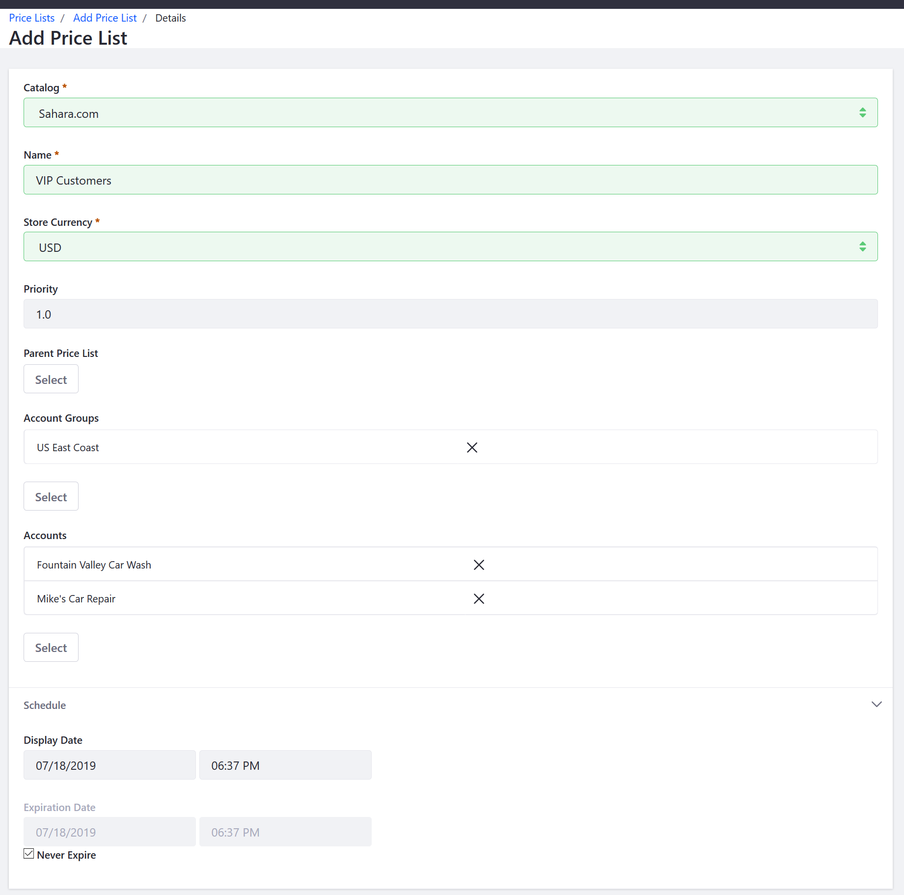

# Creating a Price List

Price Lists are an easy way to set alternate prices (higher or lower than the base price) for a given product or allow use of a currency other than the store’s default for selected Accounts and Account Groups.

This article describes how to create a price list.

1. Navigate to the _Control Panel_ → _Commerce_ → _Price Lists_.
1. Click the (+) button.
1. Enter the following fields (example values shown below):
    * **Catalog**: Sahara.com
    * **Name**: VIP Customers
    * **Store Currency**: USD
    * **Priority**: 1.0
1. Under _Account Groups_, click _Select_.
1. Choose one or more Account Groups to have access to this price list (example account groups shown below):
    * _General_
    * _Auto Repair Shops_
1. Click _Add_.
1. Under _Accounts_, click _Select_.
1. Choose one or more Accounts to have access to this price list (example accounts shown below):
    * Mike’s Car Repair
    * Fountain Valley Car Wash
1. Click _Add_.
1. Choose a Schedule for the price list. (Leave the _Never Expire_checkbox checked in this example. Alternatively, you can set a date range for when the price list is active.)

    

1. Click _Publish_.

The price list (_VIP Customers_ in this example) has been created and applied to the chosen Account Groups and Accounts. Repeat the steps to create other price lists as necessary.

## Additional Information

* [Creating a New Account Group](../../customers/account-management/creating-a-new-account-group/README.md)
* [Creating a New Account](../../customers/account-management/creating-a-new-account/README.md)
* [Adding Products to a Price List](../adding-products-to-a-price-list/README.md)
* [Adding Tiered Pricing](../adding-tiered-pricing/README.md)
