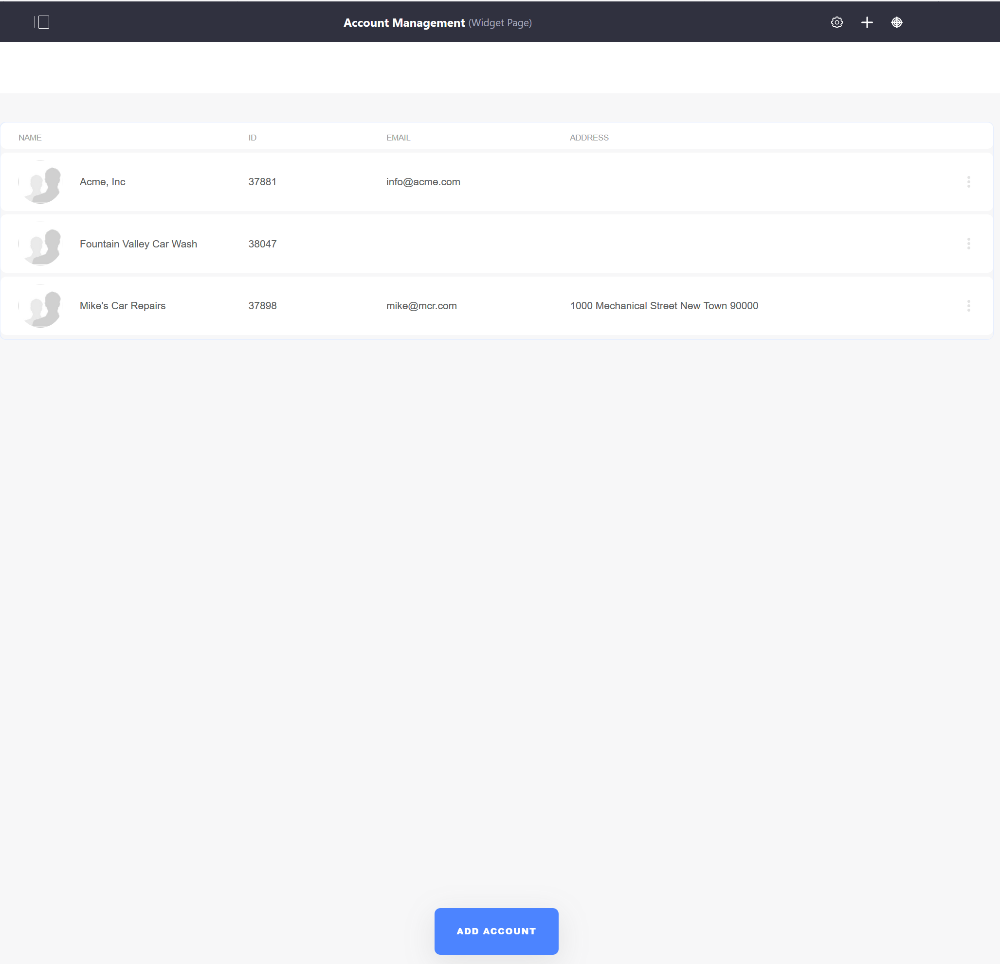
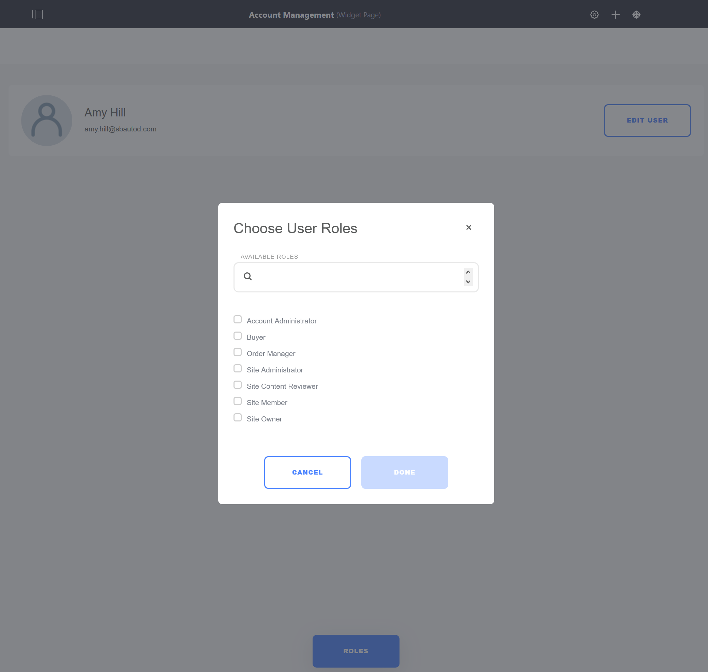

# Account Management

The Account Management page is where Store administrators and Account Managers manage Users and Accounts. Users may be invited to the store and assigned account-specific roles (Buyer, Sales Manager, Account Manager, and Sales Agent). Accounts may also be created on this page.

If using Minium Accelerator to create sample data, there is a site Navigation Menu where the _Account Management_ widget is located:

Once deployed to the page, the _Account Management_ widget lists all the accounts.

New accounts may be created and users may be assigned to accounts.

Account information like address, related organization(s), and phone number may also be added through the Account Management page.

[Image Placeholder]()

Account specific roles may be assigned to users.

New shipping or billing addresses may also be added to accounts using the Account Management page.

