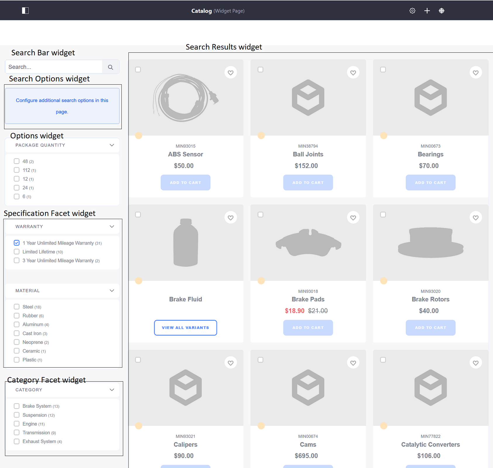
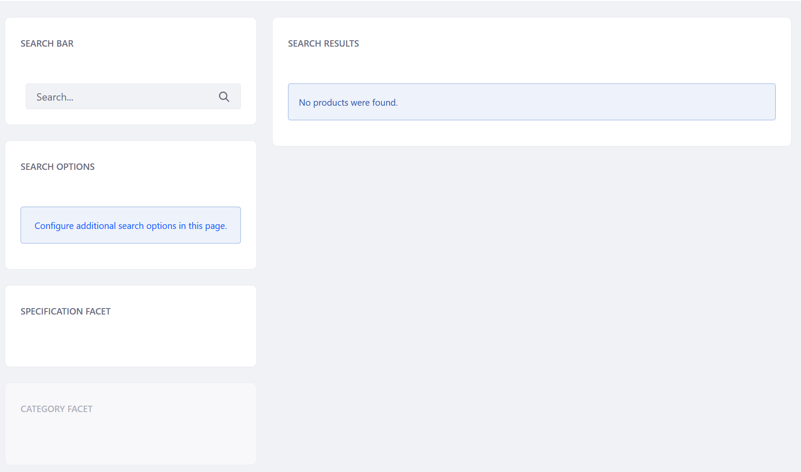

# Catalog

The Catalog page is probably the most important required component page. It requires the following widgets: _Search Bar_, _Options Facets_, _Specification Facet_, _Category Facet_ and _Search Results_.

If using Minium Accelerator to create sample data, all of the widgets have been added to the page.

Otherwise, the page without any sample data but using the same layout might look like this:

