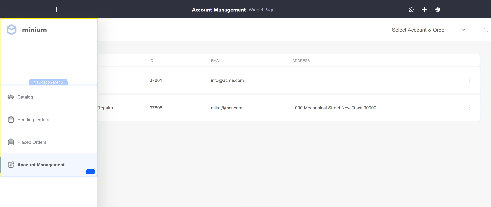
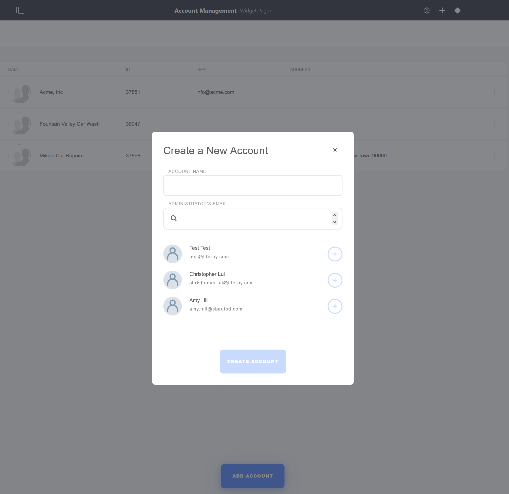
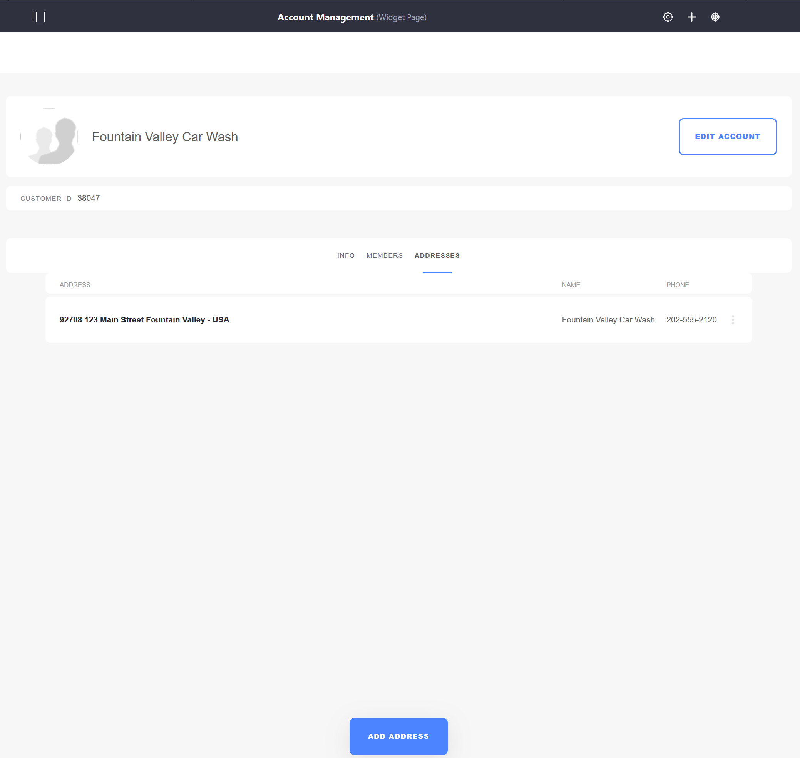

# Account Management

The Account Management page is where store administrators manage all user activity. The page is where users are invited to the store and assigned the appropriate roles (Buyer, Sales Manager, Account Manager, and Sales Agent).

If using Minium Accelerator to create sample data, there is a site Navigation Menu where the _Account Managment_ widget is located:

Once deployed to the page, the _Account Management_ widget lists all the accounts and the _Add Account_ button to add more accounts.

Clicking the _Add Account_ button displays a pop-up window to create a new account and then assigning existing users to the account.

To manage an account, click on the name inside the widget. From this page, administrators can manage the account information, such as adding an address, an organization, and inviting users. Once a user has been invited to the store site, administrators can assign a role to the user. Click on a user and then the _Roles_ button to assign a Role.

To add a new shipping or billing address to an account, click the _Addresses_ tab and then the _Add Address_ button. This opens a new window to enter the address.

