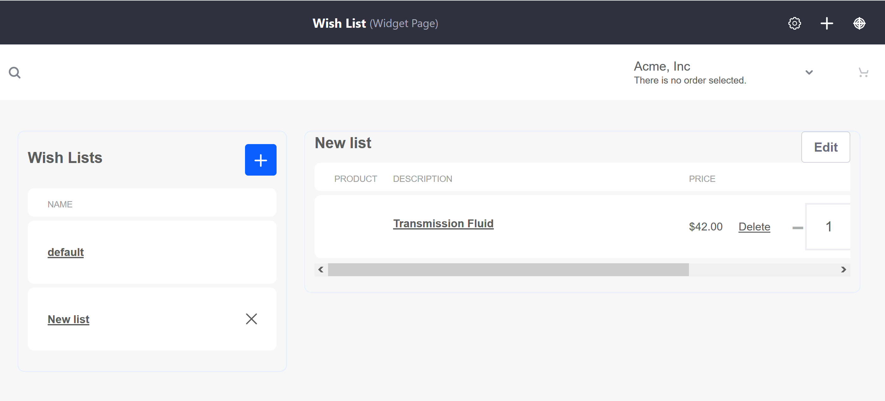

# List

The List Page is the page where buyers can create and view multiple wish lists using the _Wish Lists_ and _Wish List Contents_ widgets.

The _Wish Lists_ widget shows a list of all created wish lists created by an authenticated user. The _Wish List Contents_ widget shows all products grouped in a particular list.

Note that all wish lists are **site** specific; if a Liferay Commerce instance has more than one store site, wish lists are not transferred or saved across sites.

One example of a wish list page was created by the Minium Accelerator then adding page with the two required widgets.

Once the page has been created, a Wish List page might look like this:

