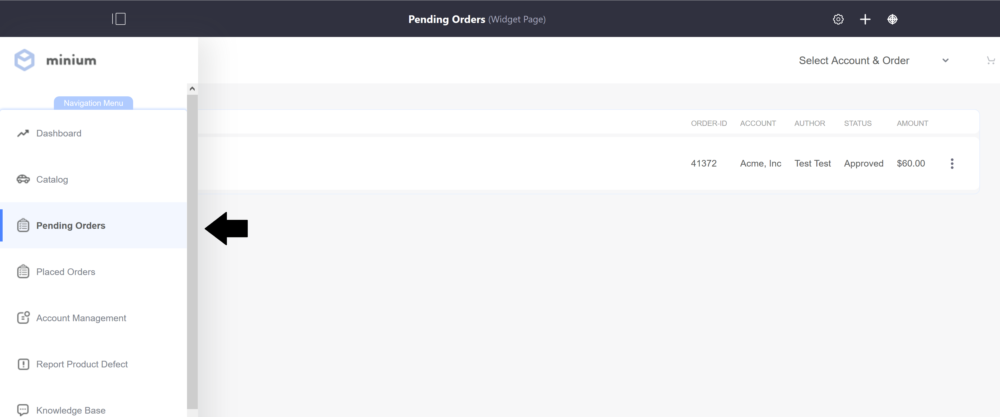
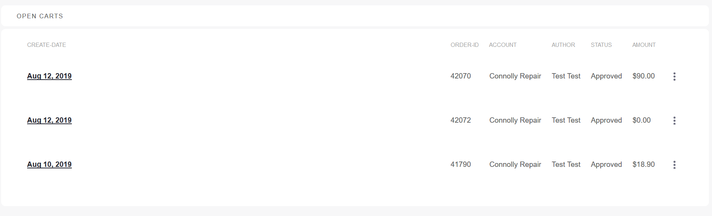
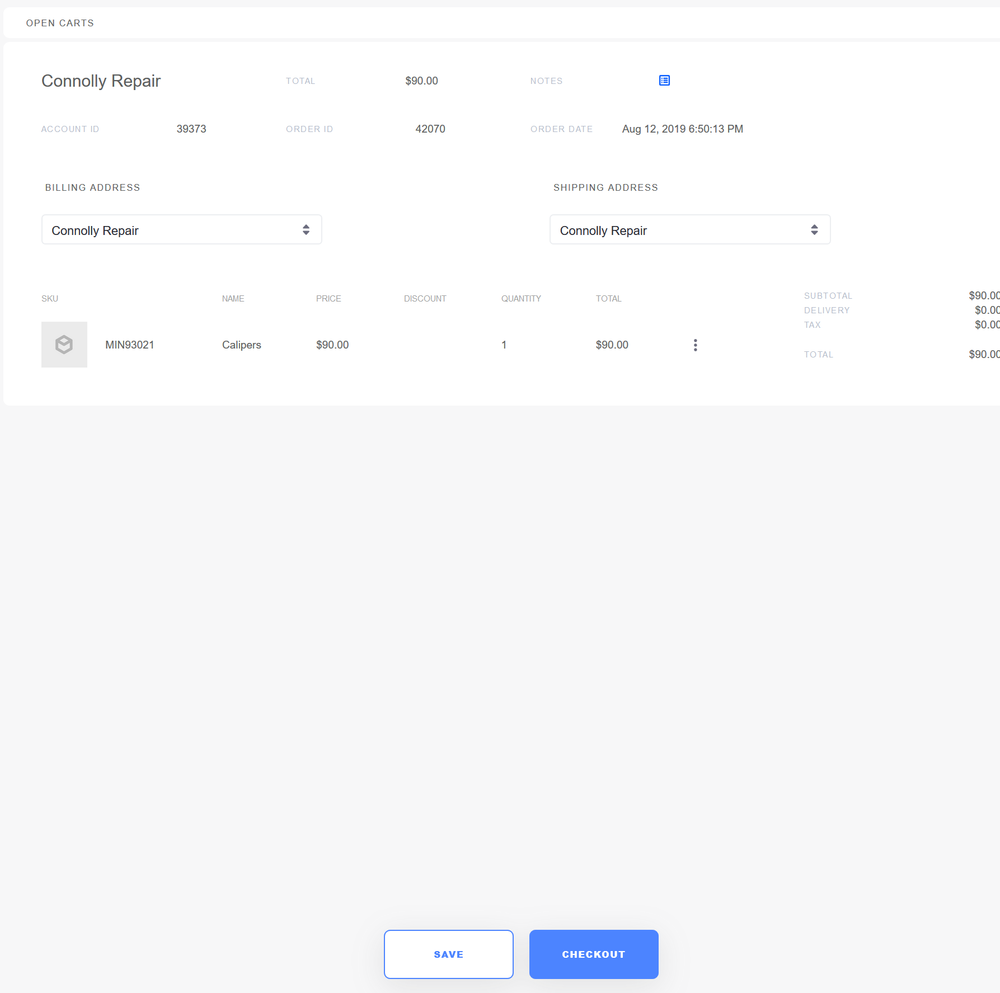

# Pending Orders

The Pending Orders page is a page where order managers can view all incomplete orders associated with an account; an incomplete order contains items in the cart but has not been through the checkout process. In addition, the Pending Orders page contains the _Add Order_ button to allow order managers to create multiple orders at the same time.

The Pending Orders page uses the _Open Carts_ widget. If using the [Minium Accelerator](../../../getting-started/accelerators/using-the-minium-accelerator-to-jump-start-your-b2b-store/README.md) to create sample data, the _Placed Order_ page has already been created and can be found in the site Navigation Menu.

The _Open Carts_ widget displays a list of orders associated with an account:

Selecting an account from the Account Selector dropdown menu and then clicking the _Add Order_ button begins the process of creating an order.

Once items have been added to the cart, order managers can review the pending orders before checkout.

Note that the review process this page might be affected if [Order Workflows](../../../sales/order-management/order-workflows/README.md) are required. If order workflows are enabled, there are three possible scenarios: seller-agent approval is required, buyer approval is required, or in the third case, approval is required on both the seller and the buyer side.

## Additional Information

* [Widget Reference Guide](../widget-reference/README.md)
* [Creating Pages](https://help.liferay.com/hc/en-us/articles/360018171291-Creating-Pages)
* [Workflows](../../../sales/order-management/order-workflows/README.md)