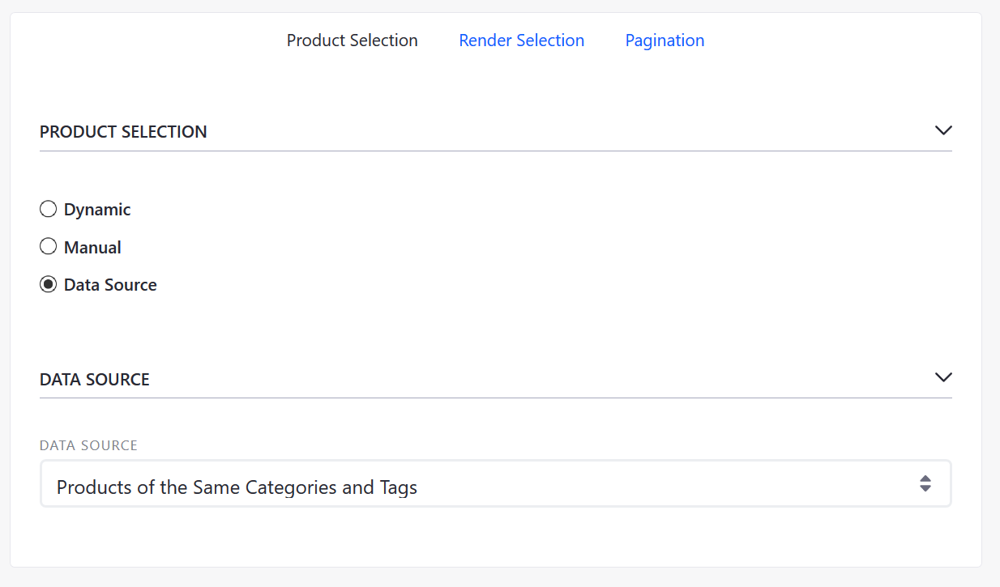

# Product Details

The Product Details page is a required storefront page that used to display a product's vital information. Usually, the Product Details page contains information such as a short description about the product, its specifications, and associated product images. The Product Details page may contain links to any related products. This sample page below is built using the Minium Accelerator and contains the _Product Details_, _Product Publisher_, and the _Product Comparison Bar_ widgets.

Note that the _Product Comparison Bar_ widget is populated only when one or more products are selected.

In this example, the _Product Publisher_ widget has been configured to display similar items that have the same Categories and Tags. Store administrators can change the contents of this widget to display other types of related products. For more information, see the [Related Products, Upsells, and Cross-Sells](../../../catalog/creating-and-managing-products/product-information/related-products-up-sells-and-cross-sells/README.md) article.

## Additional Information

* [Related Products, Upsells, and Cross-Sells](../../../catalog/creating-and-managing-products/product-information/related-products-up-sells-and-cross-sells/README.md)