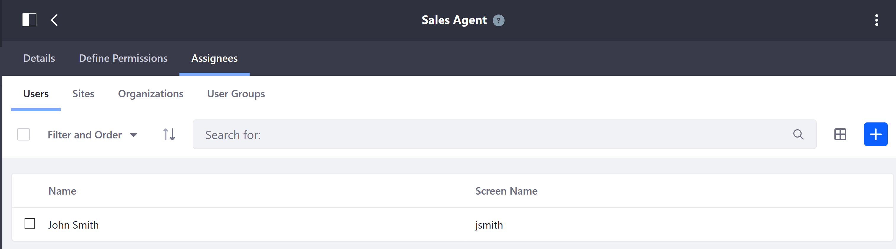

# Account Roles

Account Roles are sets of permissions provided by Liferay Commerce to empower users to have great customer service experiences through self-service and flexible workflows.

The following Account Roles are available for use:

* **Account Administrator** : Users with this role have permissions to modify the account, invite and add users to join the account, and assign roles to other account members. This role also includes the permissions for all other Account Roles listed.

* **Buyer**: Users with this role can view, create, and check out orders.

* **Order Manager**: Order Managers have all the permissions of buyers, and can also manage, delete and approve orders.

These roles can be used to enable a full purchasing workflow on your site. Roles may be created and customized as needed to achieve a workflow that meets specific business needs. For more information see [Roles and Permissions](https://help.liferay.com/hc/articles/360017895212-Roles-and-Permissions) for more information.

## Seller-side Account Management Roles

Accounts can also be managed by Administrators and Sales Agents. The Sales Agent is a role that allows a user to manage any account assigned to him without granting him administrative permissions.

To give a sales agent access to accounts:

1. Group your accounts in organizations using the Accounts Widget.
1. Associate sales agents with the same organizations.

Sales agents can access any account within any of their associated organizations.

## Additional Information

* [Creating a New Account](../creating-a-new-account/README.md)
* [Creating a New Account Group](../creating-a-new-account-group/README.md)
* [Introduction to Accounts](../introduction-to-accounts/README.md)
