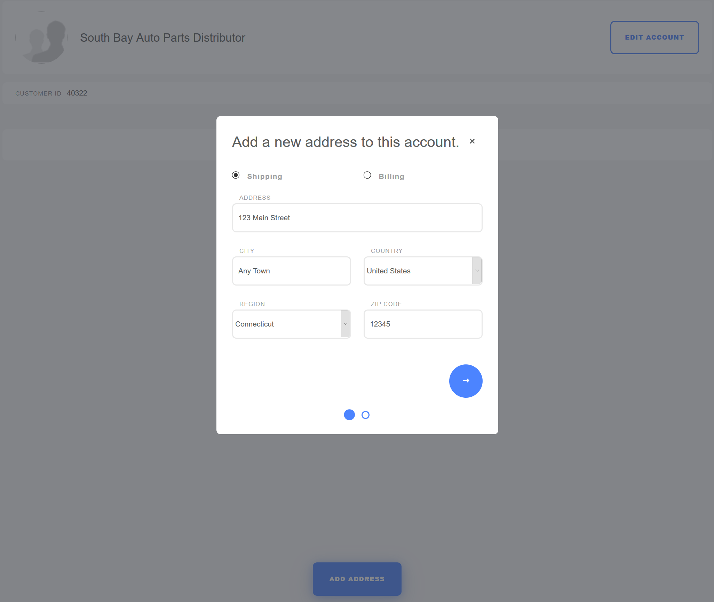

# Adding Addresses to an Account

This article documents how to update an account's billing and shipping addresses using either the _Account Management_ widget or the _Control Panel_.

## Using the Account Management Widget

1. Click the left _Navigation Menu_ → _Account Management_.
1. Click the _Addresses_ tab.

    

1. Click the _Add Address_ button.
1. Click either _Shipping_ or _Billing_ radio button.
1. Fill out the fields.

    

1. Click _Create_.

The new address has been added using the _Account Management_ widget.

## Using the Control Panel

1. Navigate to the _Control Panel_ → _Users_ → _Accounts_.
1. Click an account (for example, _Acme International_).
1. Click _Address_ in the left menu.
1. Fill the address fields.
1. Check the _Default Billing_ box if this is the default billing address.
1. Check the _Default Shipping_ box if this is the default shipping address.

   

1. Click _Save_.

The Account's address has been updated in the Control Panel settings.
