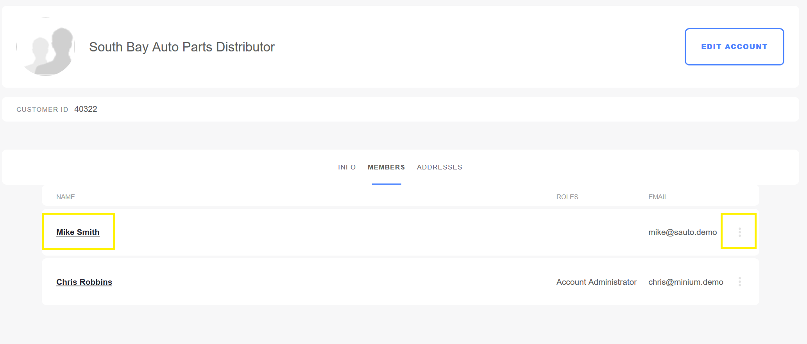

# Assigning User Roles

To assign an account role:

1. Click on the name link (for example _Mike Smith_).

    

1. Click _Roles_.
1. Check all the applicable roles.

    

1. Click _Done_.

This user has been assigned to the _Buyer_ role.

## Additional Information

* [Account Roles](../account-roles/README.md)
