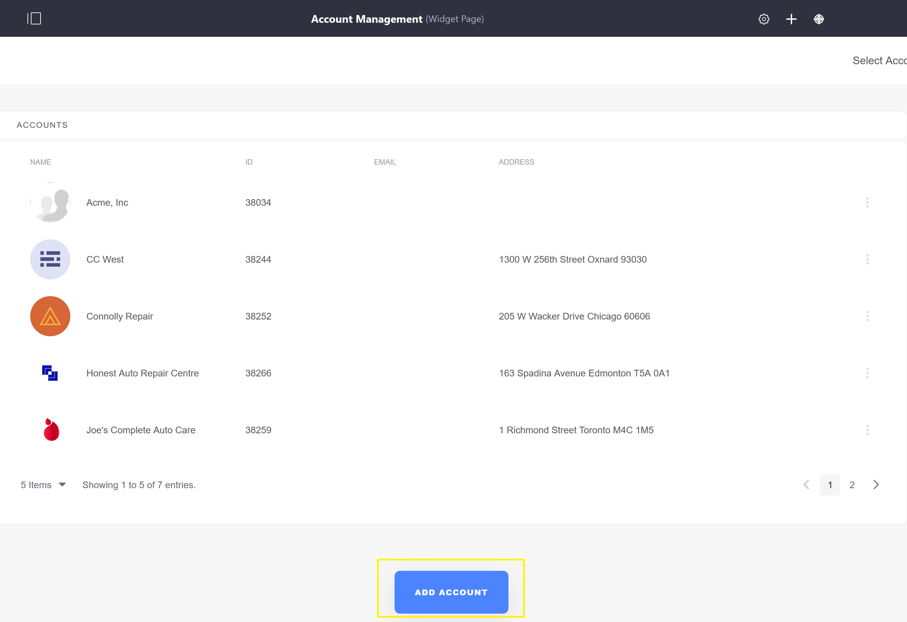

# Creating a New Account

Visitors to your store can open an account to manage their purchases and activities. Using their account, buyers can place and change orders in the B2B or B2C environment. Accounts such as those for corporations can have multiple users as points of contact for the entity to conduct their activities.

This article documents how to create a new account.

1. Go to the _Control Panel_ → _Users_ → _Accounts_.
1. Click the (+) button to add a new account.
1. Enter the following:
    * **Name**: _your company name_ (Acme International)
    * **Email**: _your company email_ (Acme1@acme.org)
    * **Type**: _Business_
    * **VAT Number**: _your VAT number*_

        

1. Click _Save_.

To add the default shipping and billing addresses:

1. Click the _Address_ link.
1. Fill the address fields.

    

1. Click _Save_.

The account Acme International has been created. It is __not__ necessary to associate an organization when creating an account. Moreover, the list of organizations are populated from the platform's default [Organizations](https://help.liferay.com/hc/articles/360018174351-Organizations) list and these have to be created separately.

## Additional Information

 **Note 1**: A VAT number is only required for companies doing business in Europe and LATAM.
