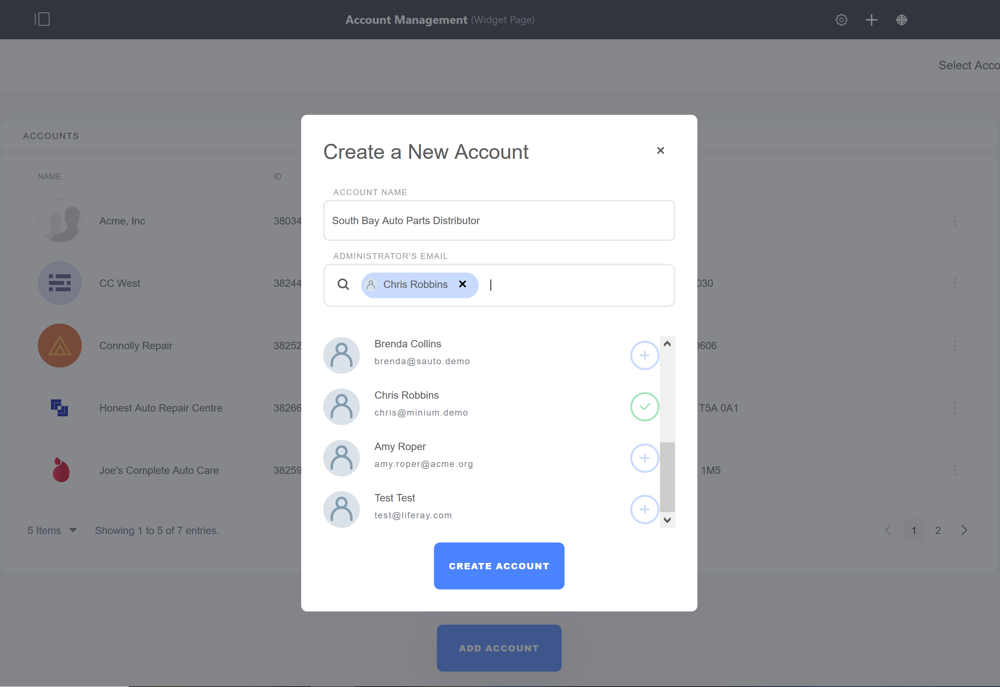
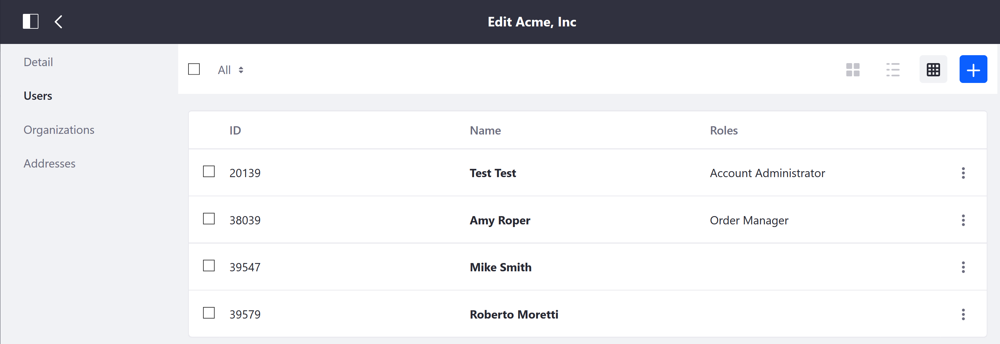

# Managing Users and Accounts

Visitors to your store can open an account to manage their purchases and activities. Using their account, buyers can place and change orders in the B2B or B2C environment. Accounts such as those for corporations can have multiple users as points of contact for the entity to conduct their activities.

There are two possible ways to create an account: 1) using the _Account Management_ widget and 2) through the _Control Panel_. Both achieve the same function with some key differences. Content in the _Account Management_ widget is site specific while the Control Panel is applied across all store sites. Furthermore, access to the _Control Panel_ is restricted to those with store administrators or higher privileges and omni-admnistrators ("back office").

## Roadmap

* Using the Account Management Widget
  * Create a new Account
  * Edit Account Information
  * Invite Users to the Account
  * Assign Account Roles
  * Add Different Addresses
* Using the Control Panel
  * Create a new Account
  * Add Users to the Account
  * Assign Account Roles
  * Add Addresses

## Using the Account Management Widget

### Create a new Account

1. Click the left _Navigation Menu_ → _Account Management_.
1. Click the _Add Account_ button.

    

1. Enter the following:
    * **Account Name**: South Bay Auto Parts Distributors
    * **Administrator's Email**: (Enter a valid email address or select from an existing one.)

    

1. Click _Create Account_.

The new account has been created. From this point, the store administrators can perform various actions to update the account.

### Edit Account Information

1. Click _Edit Account_.
1. Enter the following:
    * **Email**: Account's Email address (for example, info@sbapd.com)
    * **Country**: USA
    * **Region**: Colorado
    * **Address**: 1234 Main Street
    * **Zip**: 85000 (Postal code)
    * **City**: Anytown
    * **VAT Number**: (VAT number)

    

1. Click _Save_.

The account's information has been updated. Note that the functionalities can also be performed if the adminstrator has access to the Control Panel. See the [Creating a New Account](../account-management/creating-a-new-account/README.md) article for more information.

### Invite Users to the Account

The account's _Members_ tab is where administrators can add more users to the account. All accounts already have one account administrator assigned during initial creation and more users can be assigned to this role.

   

1. Click _Invite User_.
1. Enter a valid Email address or select from an existing one (for example, Mike Smith)

    

1. Click _Invite User_.

This user has been assigned to the account.

### Assign Account Roles

To assign an account role:

1. Click the _3-dot_ icon next to Mike Smith.
1. Click _View_.

    

1. Click _Roles_.
1. Check all the applicable roles.

    

1. Click _Done_.

This user has been assigned to the _Buyer_ role.

### Add Different Addresses

By default, the address initially used during account creation is the shipping address. If the entity has different shipping and billing addresses, click the _Addresses_ tab to enter another address.

1. Click the _Add Address_ button.
1. Click either _Shipping_ or _Billing_ radio button.
1. Fill out the fields.
1. Click _Create_.

The new address has been created.

## Using the Control Panel

Alternately, users who have store or omni-administrator privileges can create and update Account information in the Control Panel. This gives the store administrator the benefit of making changes across sites.

1. Navigate to the _Control Panel_ → _Users_ → _Accounts_.
1. Click the (+) button to add a new account.
1. Enter the following:
    * **Name**: _your company name_ (Acme International)
    * **Email**: _your company email_ (Acme1@acme.org)
    * **Type**: _Business_
    * **VAT Number**: _your VAT number*_

        

1. Click _Save_.

### Add Users to the Account

To add users to the account:

1. Click _Users_ in the left menu.
1. Click the (+) button to add a new user.
1. Chcck the boxes for all the users to be added.
1. Click _Add_.

The users have been added to the account. Note that the roles have not been assigned yet.

### Assign Account Roles

The Account Roles can be added through the _Account Management_ widget (see above).

### Add Addresses to the Account

To add the default shipping and billing addresses:

1. Navigate to the _Control Panel_ → _Users_ → _Accounts_.
1. Click the account (for example, _Acme International_)
1. Click _Address_ in the left menu.
1. Fill the address fields.

    

1. Click _Save_.

The account Acme International has been created. It is __not__ necessary to associate an organization when creating an account. Moreover, the list of organizations are populated from the platform's default [Organizations](https://help.liferay.com/hc/articles/360018174351-Organizations) list and these have to be created separately.

## Additional Information

* [Introduction to Accounts](../account-management/introduction-to-accounts/README.md)
* [Account Roles](../account-management/account-roles/README.md)
* [Creating a New Account Group](../account-management/creating-a-new-account-group/README.md)