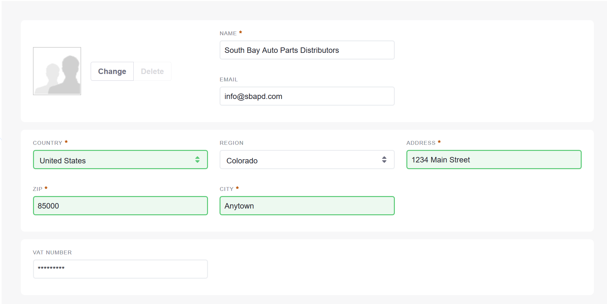
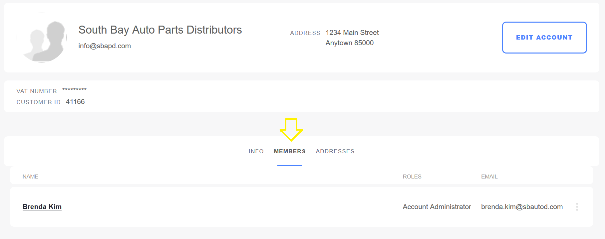
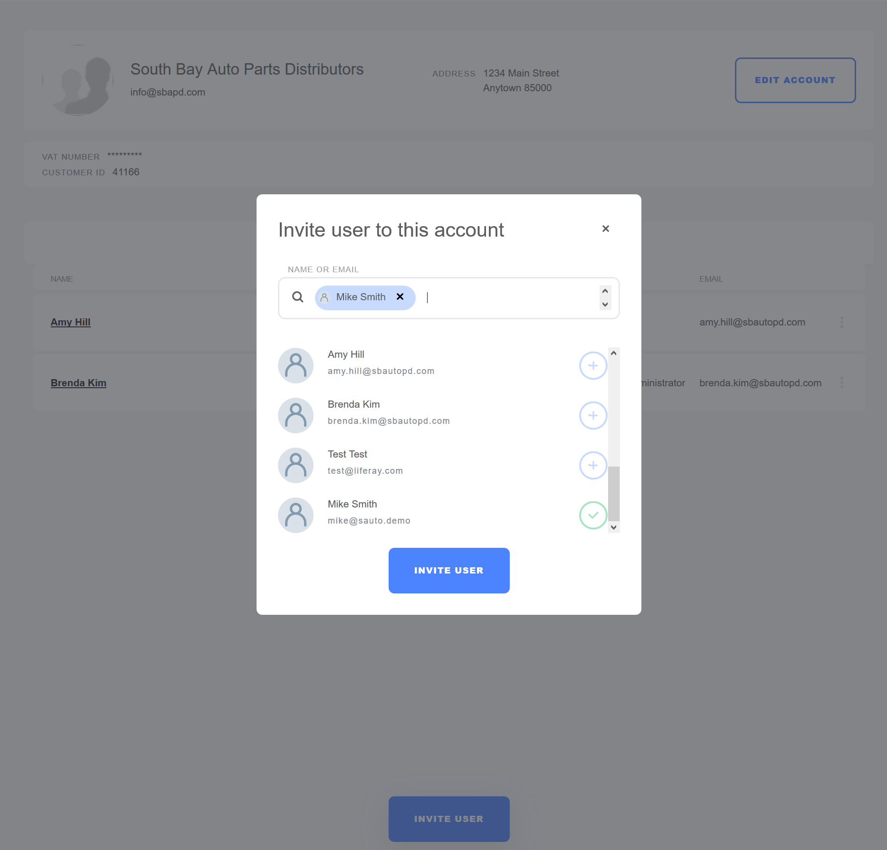
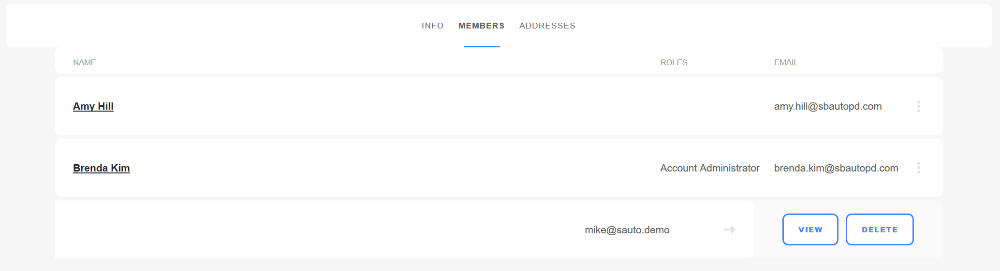

# Managing Users and Accounts

This article details how to add a new Liferay Commerce Account, invite users, and manage accounts using the dedicated _Account Management_ widget. This widget is a one-stop place for store managers to view all available information about users and accounts.

If using the Minium Accelerator to create a store site, the site Navigation Menu has already been created to house the _Account Management_ page.

## Roadmap

* Create a new Account
* Edit Account Information
* Invite Users to the Account
* Assign Account Roles
* Add Different Addresses

### Create a new Account

1. Click the left _Navigation Menu_ → _Account Management_.
1. Click the _Add Account_ button.
1. Enter the following:
    * **Account Name**: South Bay Auto Parts Distributors
    * **Administrator's Email**: (Enter a valid email address or select from an existing one.)
1. Click _Create Account_.

The new account has been created. From this point, the store administrators can perform various actions to update the account.

### Edit Account Information

1. Click _Edit Account_.
1. Enter the following:
    * **Email**: Account's Email address (for example, info@sbapd.com)
    * **Country**: USA
    * **Region**: Colorado
    * **Address**: 1234 Main Street
    * **Zip**: 85000 (Postal code)
    * **City**: Anytown
    * **VAT Number**: (VAT number)

    

1. Click _Save_.

The account's information has been updated. Note that the functionalities can also be performed if the adminstrator has access to the Control Panel. See the [Creating a New Account](../account-management/creating-a-new-account/README.md) article for more information.

### Invite Users to the Account

The account's _Members_ tab is where administrators can add more users to the account. All accounts already have an account administrator assigned during initial creation.

   

1. Click _Invite User_.
1. Enter a valid Email address or select from an existing one (for example, Mike Smith)

    

1. Click _Invite User_.

This user has been assigned to the account.

### Assign Account Roles

To assign an account role:

1. Click the _3-dot_ icon next to Mike Smith.
1. Click _View_.

    

1. Click _Roles_.
1. Check all the applicable roles.

    

1. Click _Done_.

This user has been assigned to the _Buyer_ role.

### Add Different Addresses

By default, the address initially used during account creation is the shipping address. If the entity has different shipping and billing addresses, click the _Addresses_ tab to enter another address.

1. Click the _Add Address_ button.
1. Click either _Shipping_ or _Billing_ radio button.
1. Fill out the fields.
1. Click _Create_.

The new address has been created.

## Additional Information

* [Introduction to Accounts](../account-management/introduction-to-accounts/README.md)
* [Account Roles](../account-management/account-roles/README.md)
* [Creating a New Account](../account-management/creating-a-new-account/README.md)
* [Creating a New Account Group](../account-management/creating-a-new-account-group/README.md)