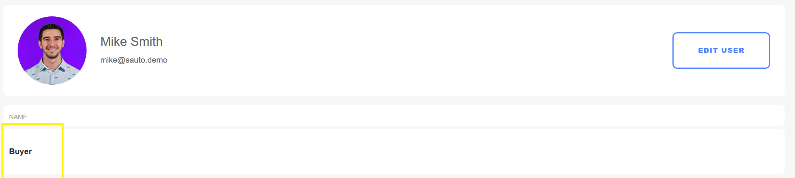

# Assigning User Roles

This article documents how to assign roles to the account users. Account Roles are sets of permissions provided by Liferay Commerce. Roles may be created and customized as needed to achieve a workflow that meets specific business needs. For more information see [Roles and Permissions](https://help.liferay.com/hc/articles/360017895212-Roles-and-Permissions) for more information.

To assign an account role:

1. Click on the name link (for example _Mike Smith_).

    

1. Click _Roles_.
1. Check all the applicable roles.

    

1. Click _Done_.

This user has been assigned to the _Buyer_ role.

## Additional Information

* [Account Roles](../../account-management/account-roles/README.md)