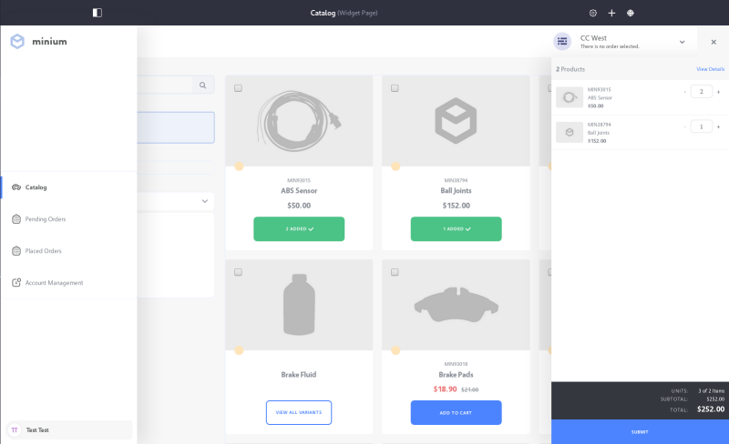

# Using the Minium Accelerator to Jump Start Your B2B Store

Minium is a Liferay Commerce Accelerator that quickly creates a business-to-business store intended to meet the needs of a wholesale distributor. The accelerator accomplishes this by providing the base hierarchy of site pages and design, sample data, and configurations for a site in a single action. Minium highlights Liferay Commerce's B2B Account Management functionality—enabling streamlined account management and self-service through use of [Account Roles](../../../customers/account-management/account-roles/README.md), [Account Groups](../../../customers/account-management/creating-a-new-account-group/README.md), and Order Workflows.

This article serves as a walk through for the main features of the Minium Accelerator.

## Pages and Design

### Pages

Minium populates a site with several pages and widgets, providing a complete user experience for buyers. To see the full list of pages created, go to Site Menu → Build → Pages.

In general, these pages work as described here, with some differences. For example, instead of using a dedicated categories page, the site's homepage displays the entire contents of the catalog. To display products of a single category, select a checkbox in the Category Facet widget.

### Design

The Minium theme includes a number of embedded features, including pop-up navigation and cart menus, and an Account & Order selector. The navigation menu provides links to the catalog, pending and past orders, and account management, while the cart menu displays the current order.

Minium does not use a conventional cart page. Instead, a link to the checkout page is included in the theme-embedded cart menu.

The Account & Order selector displays accounts that the current user can access (administrators can access any account). Once an account is selected, its open orders are displayed.

## Catalog Data

Minium's sample catalog includes a range of sample products organized into several pre-defined categories:

> Note that Categories are defined at the _Global_ scope level. For more information see [Product Categories](../../../catalog/creating-and-managing-products/categories/organizing-your-catalog-with-product-categories/README.md).

Sample products also come with pre-set with [Options](../../../catalog/creating-and-managing-products/customizing-your-product-with-product-options/README.md), [Specifications](../../../catalog/creating-and-managing-products/product-information/specifications/README.md), and Images.

## Other Configurations

Minium applies a number of other site configurations that are not set out of the box for a blank site. The following table provides a list of notable additions or configurations that Minium makes to jump start a B2B store:

| Name | Value |
| --- | --- |
| [Warehouses](../../../catalog/managing-inventory/adding-a-new-warehouse/README.md) | Italy, United States Northeast, United States Southwest |
| [Site Type](../../../getting-started/site-management-basics/sites-and-site-types/README.md) | B2B |
| [Shipping Method Options](../../../sales/shipping/using-the-flat-rate-shipping-method/README.md) | Standard Delivery, Expedited Delivery |
| Channels | Minium Portal |
| [Countries](../../../getting-started/country-options/README.md) | France, China, United States, and 245 more |
| [Currencies](../../../getting-started/currencies/adding-a-new-currency/README.md) | USD, AUD, GBP, and 7 more |
| Default Image | &#10003; |
| [Measurement Units](../../../sales/shipping/measurement-units/README.md) - Dimensions | inches, millimeters, feet, meters |
| [Measurement Units](../../../sales/shipping/measurement-units/README.md) - Weight | ounces, pounds, kilograms, grams |
| [Account Roles](../../../customers/account-management/account-roles/README.md) | Buyer, Account Manager, Sales Agent
| Availability Estimates | 3-5 days, 5-7 days, 7-14 days |
