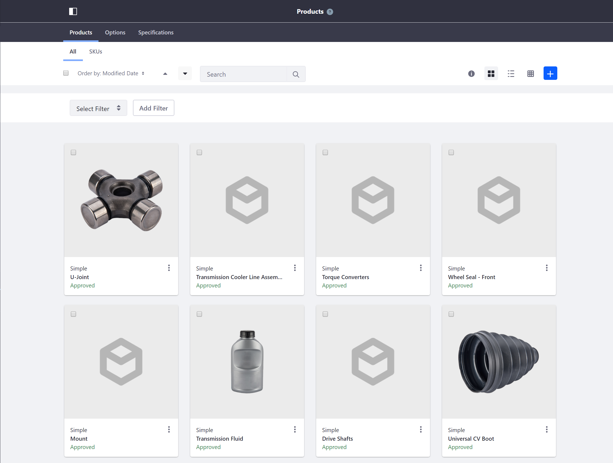

# Introduction to Liferay Commerce

Welcome to Liferay Commerce!  Liferay Commerce is a digital commerce platform built from the ground up to meet the challenging and complex needs of any B2B organization. Built on the enterprise grade foundation of Liferay DXP, users may also leverage fully integrated web content management and industry leading portal capabilities. To learn more about Liferay DXP see this [article](https://help.liferay.com/hc/en-us/articles/360028818552-Introduction-to-The-Liferay-Distinction).

## Overview

Liferay Commerce offers several major features:

* Modern Storefront Pages and Content Management
* Multi-Channel Catalog and Product Information Management
* B2B Focused Account Management and Purchasing Workflow
* Sales and Order Management
* ML Powered Recommendations and Alerts
* APIs and Integrations

Just want to get started? Launch Liferay Commerce in as long as it takes to brew a cup of coffee with our [Quick Start Guide](../../../installation-and-upgrades/quick-start-guide/README.md).

## Modern Storefront Pages and Content Management

Liferay Commerce includes a wide range of tools for setting up a storefront. New search tools, for instance, are designed specifically for product catalogs, while customizable widgets make it easy to add common UI elements—such as Checkout and View Cart—to a page. Click to learn more about [Building a Storefront](../../content/pages/creating-your-storefront/README.md).

## Multi-Channel Catalog and Product Information Management

Liferay Commerce contains a catalog management system that supports a variety of [product types](../../catalog/creating-and-managing-products/product-types/introduction-to-product-types/README.md). The catalog stores a wide range of product data—[product options](../../catalog/creating-and-managing-products/customizing-your-product-with-product-options/README.md), [pricing](../../catalog/managing-price/introduction-to-product-pricing-methods/README.md), [images](../../catalog/creating-and-managing-products/product-information/product-images/README.md), [specifications](../../catalog/creating-and-managing-products/product-information/specifications/README.md)—and makes it readily available to a distribution channel of choice.

[Channels](../../catalog/creating-and-managing-products/channels/introduction-to-channels/README.md) connect catalogs and products to any place products are sold: a Liferay Commerce based storefront, third party marketplaces, or even back office phone sales.

[Categories](../../catalog/creating-and-managing-products/categories/organizing-your-catalog-with-product-categories/README.md) and [Product Relationships](../../catalog/creating-and-managing-products/product-information/related-products-up-sells-and-cross-sells/README.md) simplify store navigation and increase revenue generating opportunities.

Managing product pricing is flexible through the use of [Price Lists](../../catalog/managing-price/price-lists/creating-a-price-list/README.md) and [Tiered Pricing](../../catalog/managing-price/price-lists/adding-tiered-pricing/README.md) - all of which can be tailored to meet unique customer needs.

## Account Management and Purchasing Workflows

Liferay Commerce is optimized for business-to-business (B2B) transactions with features designed to address B2B needs. [Accounts](../../customers/account-management/introduction-to-accounts/README.md), [Account Groups](../../customers/account-management/creating-a-new-account-group/README.md), and [Account Roles](../../customers/account-management/account-roles/README.md) work together to ensure that customer needs are met with tailored experiences, self-service, and purchasing workflows.

## Order Management and Sales

Liferay Commerce offers Order Management that enables buyers and sellers to prepare, place, approve, transmit, and approve orders.

Payments for orders may be completed with several different [payment methods](../../getting-started/payments/managing-payment-methods/README.md) available out of the box. Integration with more payment processors may be accomplished with additional customization.

Orders may be fulfilled using several different [shipping methods](../../sales/shipping/shipping-method-reference/README.md):
sellers can [impose a flat rate](../../sales/shipping/using-the-flat-rate-shipping-method/README.md), apply [shipping method restrictions](../../sales/shipping/applying-shipping-method-restrictions/README.md), or integrate with the [carrier rates like FedEx](../../sales/shipping/using-fedex-as-a-carrier-method/README.md).

<!-- [Warehouses](../../catalog/managing-inventory/inventory-reference-guide/README.md) allow Liferay Commerce to track inventories at different warehouses separately and automatically. When an order is placed, Liferay Commerce determines which warehouse is closest to the delivery point and can process the order accordingly. -->

## ML Powered Recommendations and Alerts

Liferay Commerce applies machine learning and predictive analytics to enable suggested product groups, order forecasting down to the product level, smart loyalty score alerts, and personalized product recommendations.

## APIs and Integrations

Integrate with other business systems through a Mulesoft connector, Talend component, or using pre-built connectors for Salesforce, SAP ERP (_Coming Soon_), or MS Dynamics NAV (_Coming Soon_).

## Next Steps

* [Launch Liferay Commerce in 5 Minutes or Less](../../../installation-and-upgrades/quick-start-guide/README.md)
* [Setup a Complete B2B Site Using the Minium Accelerator](../../getting-started/accelerators/using-the-minium-accelerator-to-jump-start-your-b2b-store/README.md)
* Learn What's New in Liferay Commerce 2.0.2
