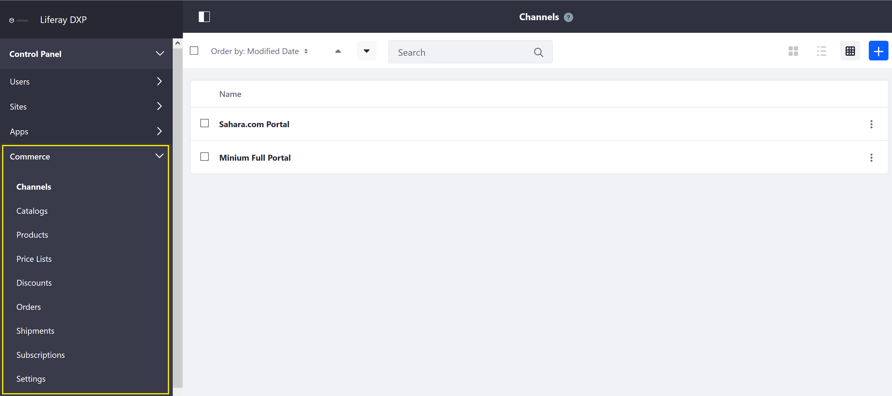
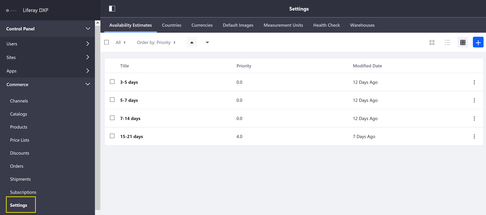

# Liferay Commerce Control Panel

This article introduces several Commerce-specific menus in the _Control Panel_ and is a walk through for the basic configuration and scope settings.

## Global Commerce Settings

Navigate to the _Control Panel_ → _Commerce_. Making changes to any of the follow configurations will apply across the store sites.

* [Channels](../../catalog/creating-and-managing-products/channels/managing-channels/README.md)
* Catalogs
* Products
* [Price Lists](../../catalog/managing-price/price-lists/creating-a-price-list/README.md)
* Discounts
* [Orders](../../sales/order-management/orders-menu/README.md)
* Shipments
* Subscription
* Settings (See below.)

The Commerce Global Settings menu contains the following tabs:

* [Availability Estimates](../../catalog/managing-inventory/availability-estimates/README.md)
* [Countries](../country-options/README.md)
* [Currencies](../currencies/README.md)
* Default Images
* [Measurement Units](../../sales/shipping/measurement-units/README.md)
* Health Check
* [Warehouses](../../catalog/managing-inventory/warehouse-reference-guide/README.md)

## Site Specific Settings

The following configurations apply to just the store's site. Changes here are not applied to other stores hosted on the same Liferay Commerce instance.

Navigate to the _Control Panel_ → _Store Site_ → _Commerce_.

### Settings (Site)

The following site settings are found here:

* Category Display Pages
* Health Check
* [Notifications](../../marketing/email-notifications/automating-store-emails-by-using-notification-templates/README.md)
* [Order Workflows](../../sales/order-management/order-workflows/README.md)
* Order Fields
* [Payment Methods](../payments/README.md)
* Product Display Pages
* [Shipping Methods](../../sales/shipping/README.md)
* [Site Types](../site-management-basics/sites-and-site-types/README.md)
* [Taxes](../../operations/taxes/README.md)

## Account Settings

The ability to manage accounts and account groups from the Control Panel is available for store administrators or those with higher privileges. Otherwise, account managers should use the _Account Management_ widget.

See the [Introduction to Accounts](../../customers/account-management/introduction-to-accounts/README.md) and [Creating a New Account](../../customers/account-management/creating-a-new-account/README.md) articles for more information.

Navigate to the _Control Panel_ → _User_ → _Accounts_. These settings apply to business and personal accounts.

### Accounts

### Account Groups

Navigate to the _Control Panel_ → _User_ → _Account Groups_. These settings apply to account groups.

