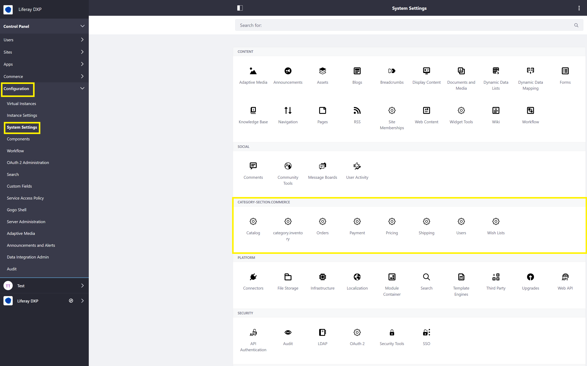
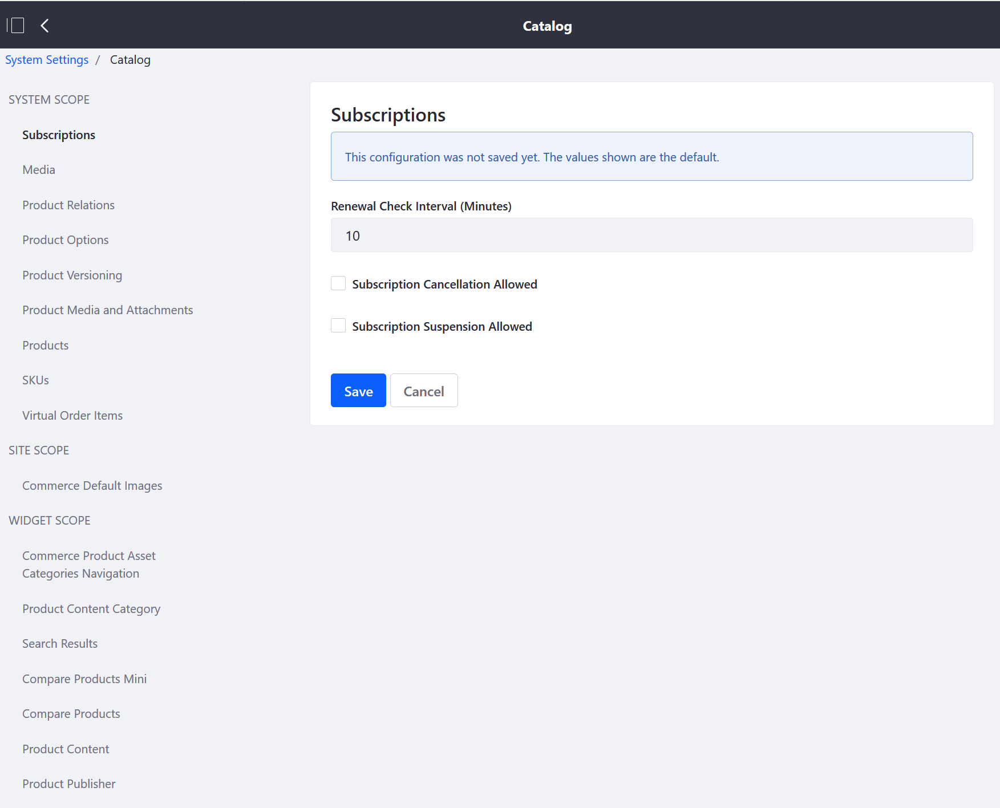
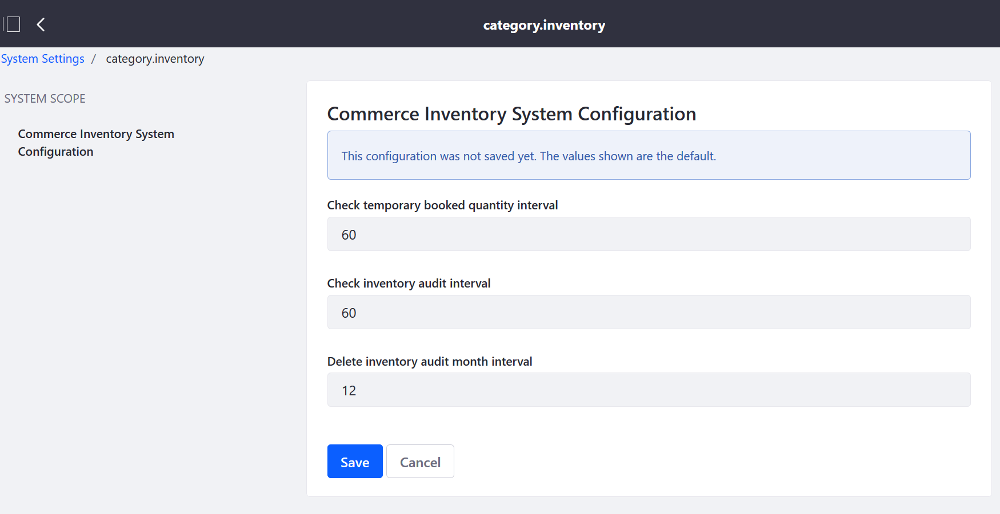
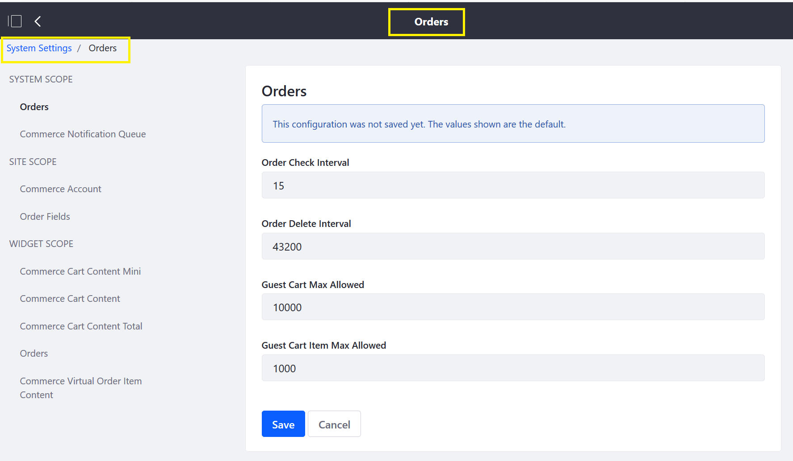
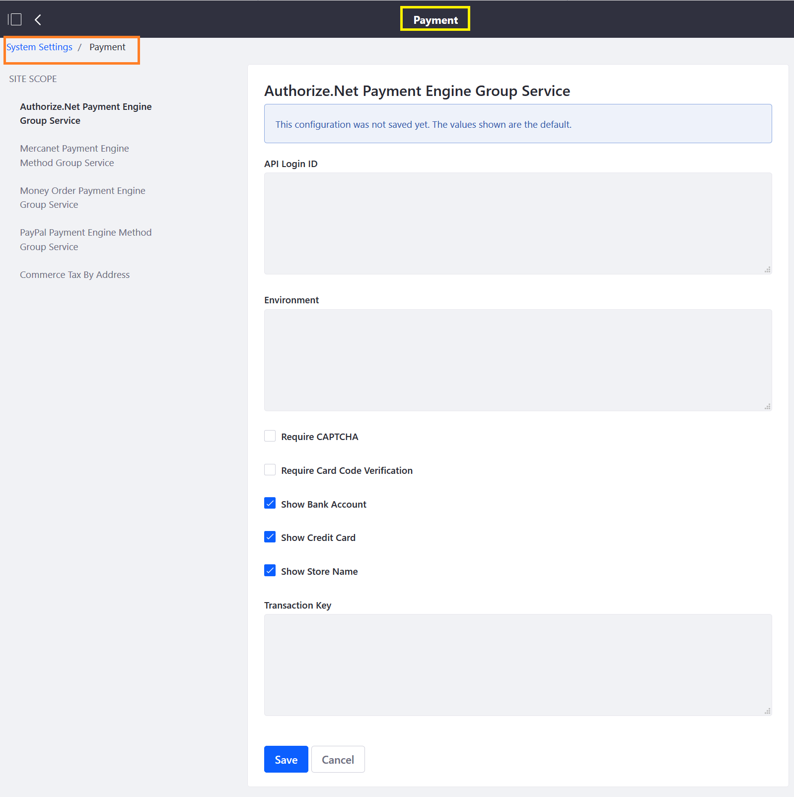
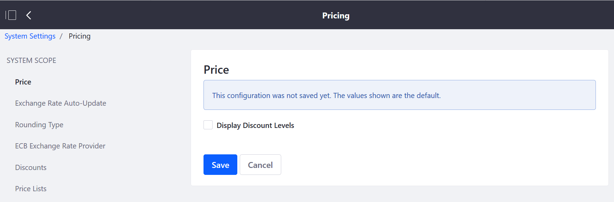
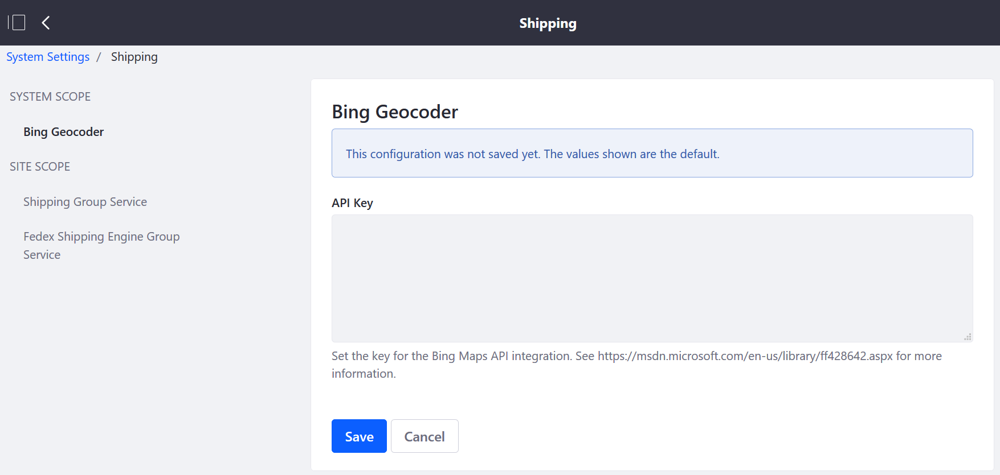
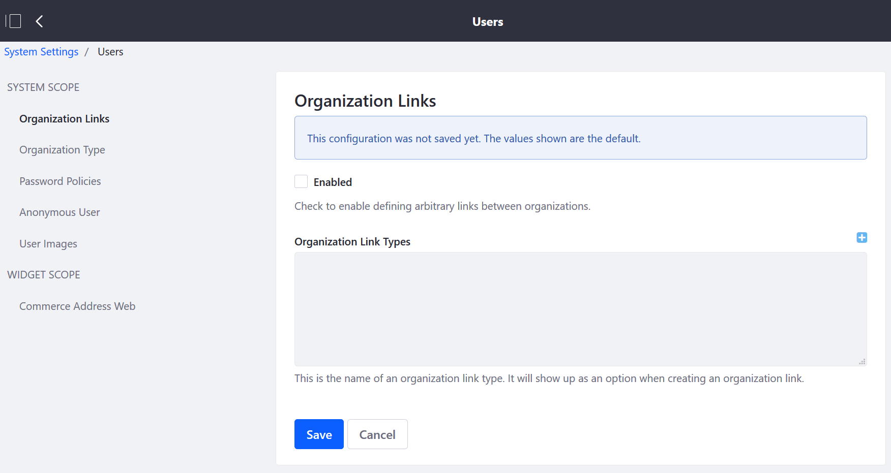
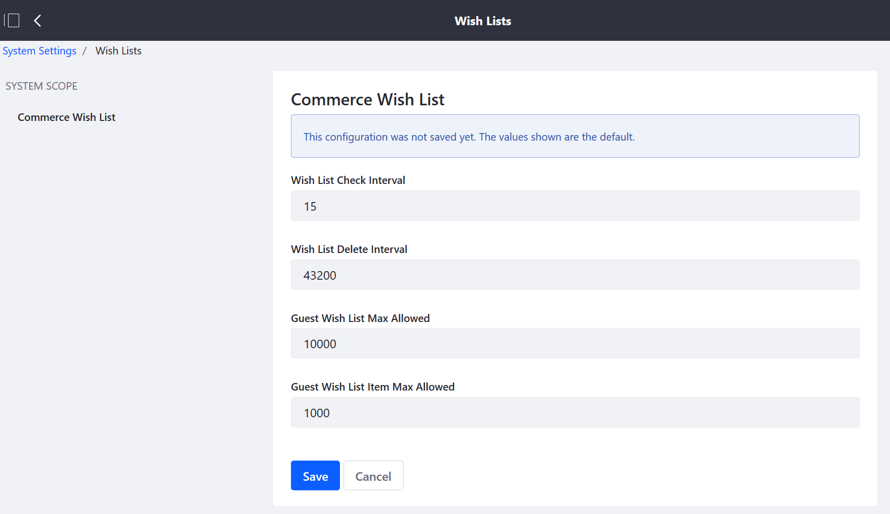

## Liferay Commerce System Settings Reference

This article is a reference for the system level settings in Liferay Commerce. These settings are managed by the **system** administrators and thus not visible to anyone else. Many of these configurations pertain to the back end engines that power the instance.

Navigate to the _Control Panel_ → _Configuration_ → _System Settings_.

### Catalog

### Category.Inventory

### Orders (System Settings)

### Payment

### Pricing

### Shipping

### Users

### Wish Lists

