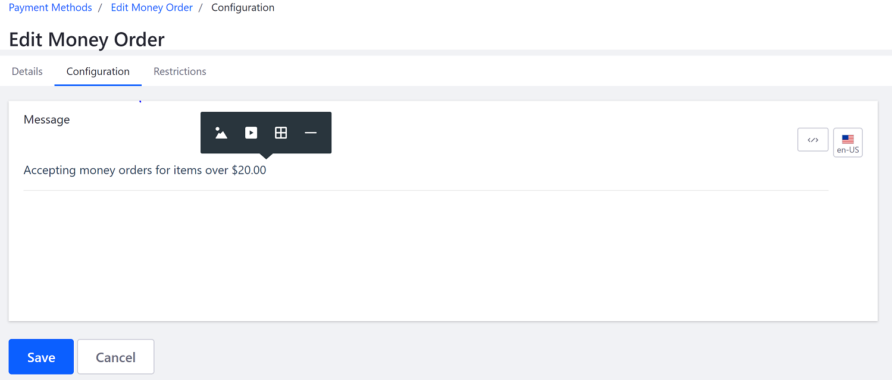

# Money Orders

Liferay Commerce has the option to enable sellers to accept money orders as a form of payment. Once this payment method is activated, buyers will be able to use money orders to complete the purchasing process. Sellers are encouraged to define and publish their store's policy on whether to accept money orders.

Besides activating Money Orders in the site settings, sellers can also create an article that documents their policies on accepting money orders on the _Payment Methods_ > _Configuration_ screen. The editor allows flexibility in displaying content including the use of tables, images, and videos inside the article.

To start creating an article:

1. Navigate to _(your Commerce site) → Commerce → Settings → Payment Methods_.
1. In the _Message_ field, create an optional note about any specific policies on money orders.
1. Click the (+) sign at the left side of the _Message_ field. The menu gives editors the option to add an image, insert a link to a video, or insert a table, or a horizontal line break.

    

1. Click _Save_.
1. Toggle the _Active_ button to _Yes_.

Your store may now accept Money Orders as a form of payment.

## Additional Information

**Note 1**: You can display your store's notes about money orders in different languages.

1. To enter your note in a different language, click on the _en-US_ icon. This displays a drop-down menu with multiple languages.  
1. Click the country flag for the language (for example, Germany).
1. Enter the translated text.
1. Click _Save_.

Your translated note will be displayed in that language whenever visitors from that locale visit that page.

**Note 2**:

For more information about where the money order note is published, read [Displaying Your Money Order Policy]().
