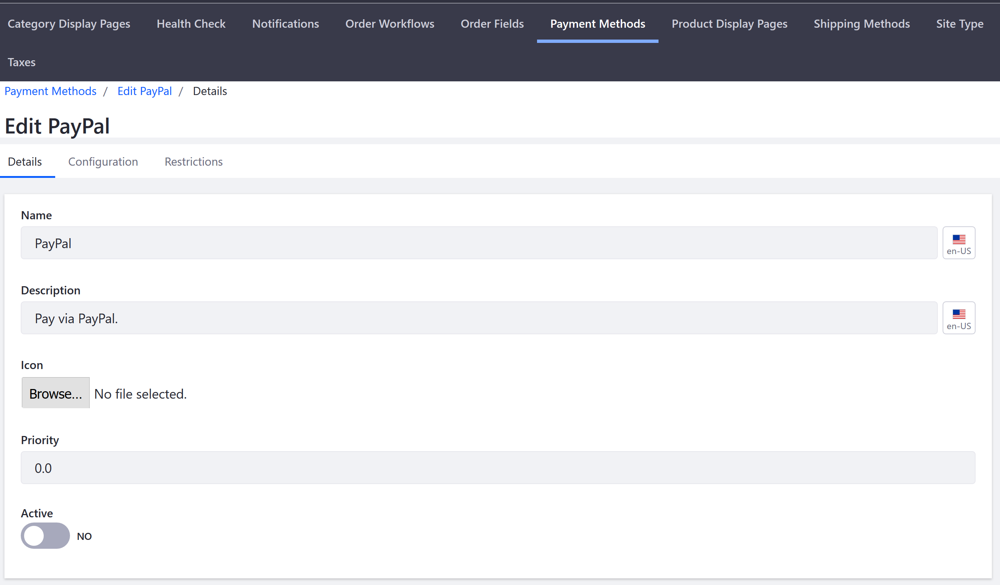
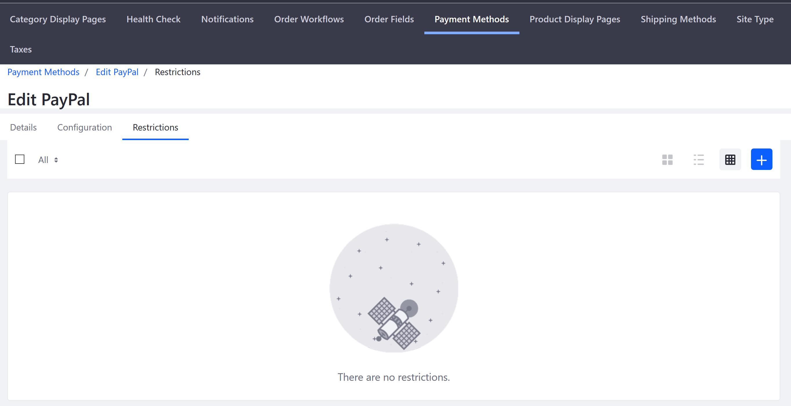

# Managing Payment Methods

To manage payment methods, navigate to the _Control Panel_ → _(your site)_ → _Commerce_ → _Settings_ and select the Payment Methods tab. Select a method to edit it.

The _Edit Payment Method_ UI has three tabs: _Details_, _Configuration_ and _Restrictions_. The _Details_ and _Restrictions_ tabs share the same fields across the different payment methods. However, each payment method has a unique configuration screen.

**Details**: Each details screen contains fields that determine how the payment method is rendered in the Checkout widget.

|Field | Description |
|----- | ----------- |
|Name  | Name of the Payment Method |
|Description | Short description of the payment method |
|Icon| Allows you to upload a small image or logo for the payment method |
|Priority | Allows you to determine the order of that the payment method is display; lower numbers are displayed higher|
|Active | Toggles the button to activate or deactive a payment method|  

**Configuration**: For information about payment method configuration please see the Additional Information.

**Restrictions**: A restriction deactivates a payment method for buyers in specified countries.

## Additional Information

* [Authorize.net](../../../sales/payments/payment-methods/authorize.net/README.md)
* [Mercanet](../../../sales/payments/payment-methods/mercanet/README.md)
* [Money Orders](../../../sales/payments/payment-methods/money-orders/README.md)
* [PayPal](../../../sales/payments/payment-methods/paypal/README.md)
