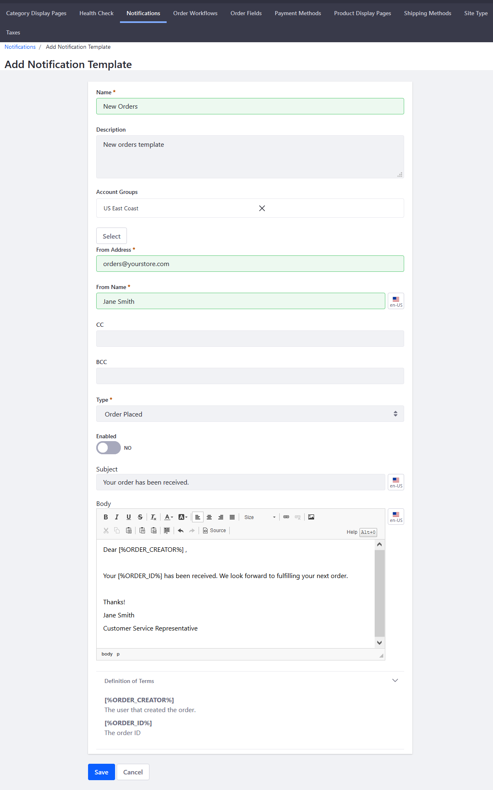

# Creating a Notification Template

Notifications are automated emails sent to buyers. By default, notifications can only be sent to inform buyers when an order has been received. Notifications require a Notification Template, which defines the notification’s sender, its trigger, and its content. To use Liferay Commerce's Notifications feature, system administrators _first_ have to configure the Mail settings for Liferay Digital Experience Platform (DXP). See the article [User Subscriptions and Mailing Lists](https://help.liferay.com/hc/en-us/articles/360017896652-Installing-Liferay-DXP#configuring-mail) for more information.

Once the Mail settings have been configured, follow these steps create a notification for a received order:

1. Navigate to the _Control Panel_ → _(your store)_ → _Commerce_ → _Settings_.
1. Click the _Notifications_ tab.
1. Click the _Notification Temlates_ sub-tab.
1. Click the (+) button to create a new Notification Template.
1. Enter the following:
    * **Name**: New Orders
    * **Description**: New orders template
    * **Account Groups**: US East Coast
    * **From Address**: Your store's email address (for example: _orders@yourstore.com_)
    * **From Name**: Name of the store or a customer service representative 
    * **Type**: Ordered Placed
    * **Enabled**: Switch the Toggle to _YES_.
    * **Subject**: Email subject (for example: _Your order has been received._)
    * **Body**: Email body. \*
    
    

1. Click _Save_.

The new Notification Template has been saved and your store will send an automated email to buyers after the store has received their order. Once the template is created, a new notification is added to the notification queue whenever an order is placed. Check the _Notifications Queue_ sub-tab when an order has been placed. Liferay Commerce checks the queue at specificed intervals and sends any unsent notifications.

## Additional Notifications

**Note 1**: \* Liferay Commerce offers two snippets to insert programatically the order creator's name and the order ID.

* \[%ORDER_CREATOR%\] inserts the user who created the order
* \[%ORDER_CREATOR%\] inserts the Order ID

**Note 2**: As noted above, the only OOTB notification function is to send an email when an order has been received but an extension point lets you develop other notifications: for a shipped order, a restocked product, a carrier exception, or any other event.

**Note 3**: To change the interval when Liferay Commerce checks for unsent notifications, navigate to the _Control Menu_ → _Configuration_ → _System Settings_. Click _Orders_ then the _Commerce Notification Queue_. The default values are listed in minutes. Change the values for the Check Interval and the Delete Interval if necessary.

* [NotificationType]()