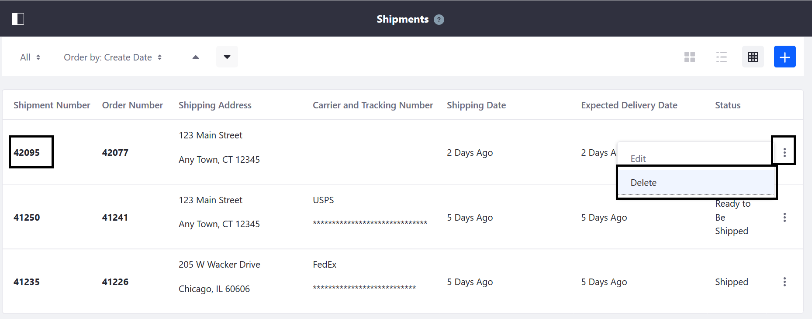
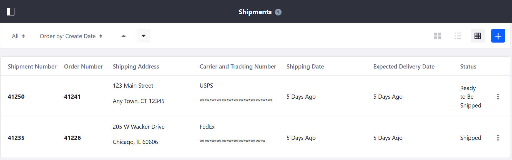
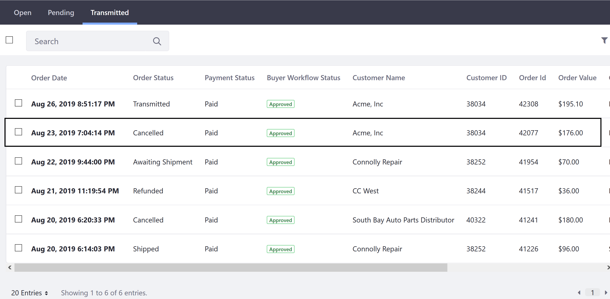

# Canceling a Shipment

This article documents how to cancel a shipment. If a buyer cancels an order but before it is shipped, the seller can cancel the shipment in Liferay Commerce. Note that cancelling a shipment does **not** does not mean the order is closed. Managing an order's ultimate status is done on the _Orders_ menu in the Control Panel.

To cancel a shipment:

1. Navigate to the _Control Panel_ _Commerce_ _Shipments_.
2. Click the _3-dot icon_ next to the shipment to be canceled (for example, _42498_).

    

3. Click _Delete_.
4. Click _OK_ in the confirmation window.

The shipment has been canceled.

Canceling a shipment changes the status in the _Transmitted_ tab in the _Orders_ menu.

Note that if a new shipment is created from the same order, a new shipment number is generated (for example, _42888_).

## Additional Information

* [Orders Menu](../../../order-management/orders-menu/README.md)
* [Order Information](../../../order-management/order-information/README.md)
