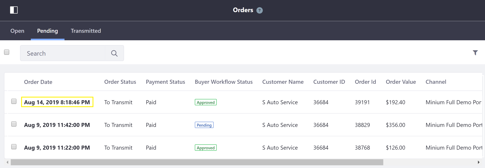
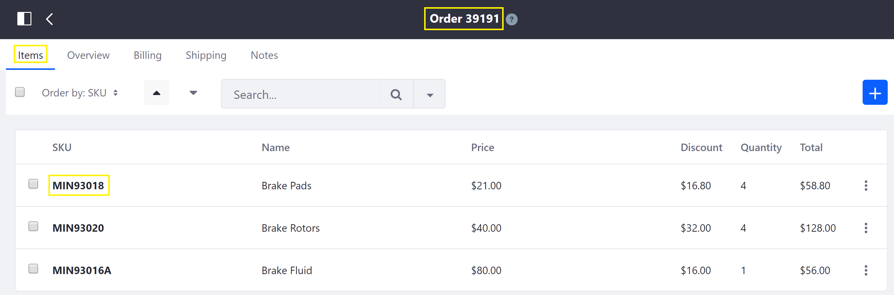
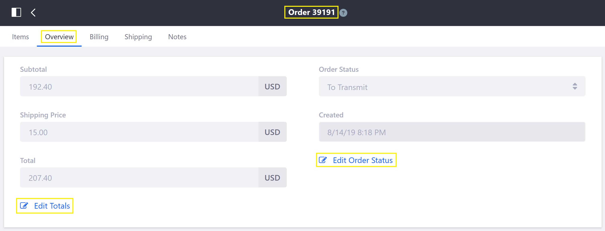
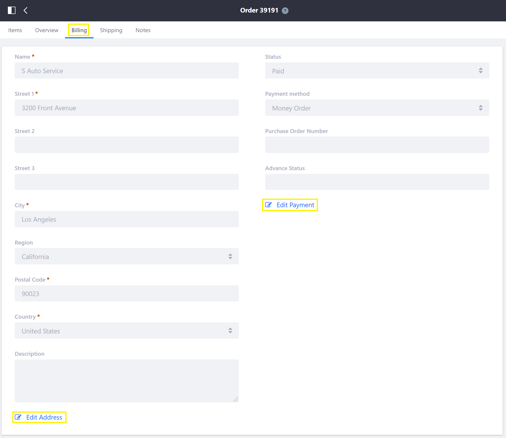
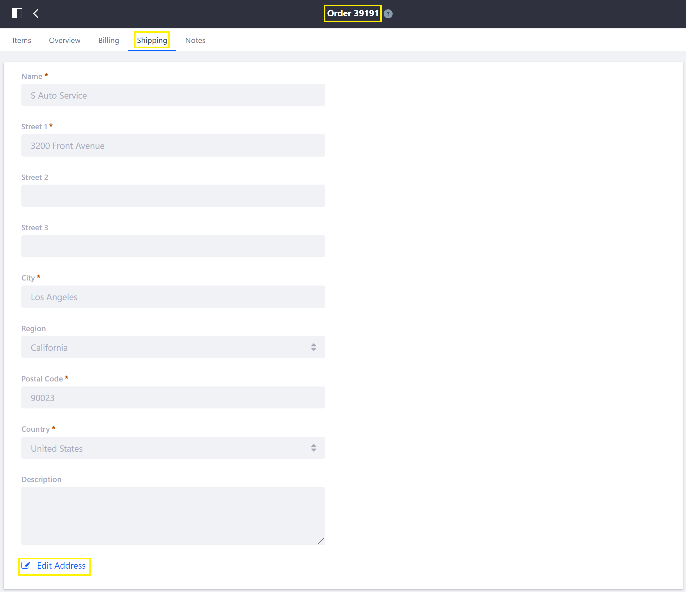
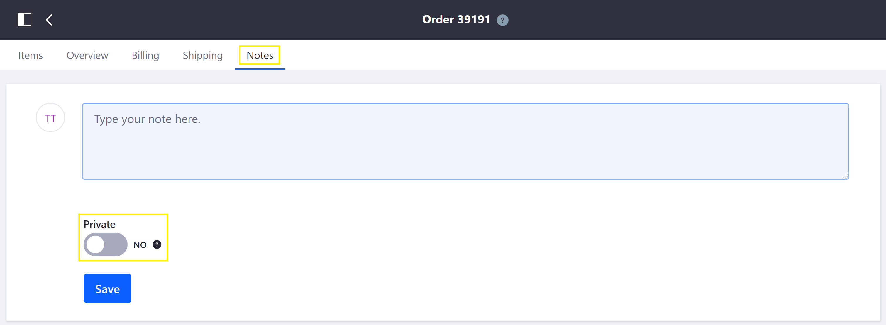

# Order Information

Administrators can view and edit order information by clicking an order in the [Orders Menu](../orders-menu/README.md).

   

This article documents the order information displayed on the following tabs: *Items*, *Overview*, *Billing*, *Shipping*, and *Notes*.

## Items

The *Items* tab shows the products, by SKU, in an order. The quantity and price can be modified by clicking on a product.

   

## Overview

The *Overview* tab shows price information, order status, and the date & time the order was created.
> **Note:** This tab is only available for orders with an Order Status other than _Open_.

   

## Billing

The *Billing* tab shows the billing address with optional description, payment status, payment method, purchase order number, and advance status.

   

## Shipping

The *Shipping* tab shows the shipping address with optional description.

   

## Notes

The *Notes* tab displays notes that have been previously added to an order and allows new notes to be added, with the option of making it private (visible only to administrators).

   

## Additional Information

* [Order Life Cycle](../order-life-cycle/README.md)
* [Orders Menu](../orders-menu/README.md)
* [Order Workflows](../order-workflows/README.md)
* Order Management Statuses
* Advancing an Order to Transmitted
* Enabling Order Workflows
* Approving/Rejecting Orders in Order Workflows
