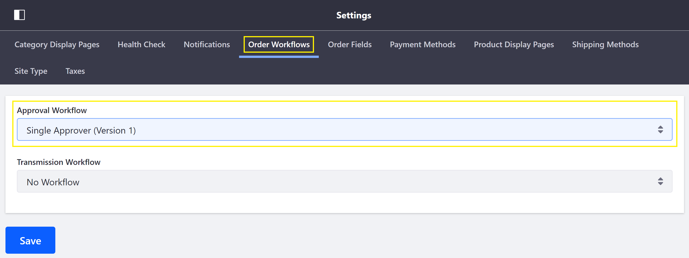

# Enabling or Disabling Order Workflows

[Order workflows](../README.md) are a site-specific setting that, if enabled, require the buyer or seller to give internal prior approval for an order before it can be processed.

This article documents how to enable and disable Order Workflows.

## Enabling Approval Workflow

To enable an approval workflow on the buyer's side, follow these steps:

1. Navigate to _Site Administration_ → _Commerce_ → _Settings_.
2. Click on the _Order Workflows_ tab.
3. Click on _Approval Workflow_ field and select from the available options in the drop down.

   

4. Click *Save*.

## Enabling Transmission Workflow

To enable a transmission workflow on the seller's side, follow these steps:

1. Navigate to the _Order Workflows_ tab (per above).
2. Click on the _Transmission Workflow_ field and select from the available options in the drop down.

   

3. Click _Save_.

## Disabling an Order Workflow

To disable an order workflow, simply navigate to the _Order Workflows_ tab, select the _No Workflow_ option, and click _Save_.

## Additional Information

**Note**: Out of the box, _Single Approver (Version 1)_ is the available order workflow. [Custom workflows](https://help.liferay.com/hc/en-us/articles/360018174111-Introduction-to-Workflow) can be created and may then be selected in the _Order Workflows_ tab.

* [Order Workflows](../README.md)
* [Approving or Rejecting Orders](../approving-or-rejecting-orders/README.md)
* [Order Life Cycle](../../order-life-cycle/README.md)
* [Orders Menu](../../orders-menu/README.md)
* Order Management Statuses
