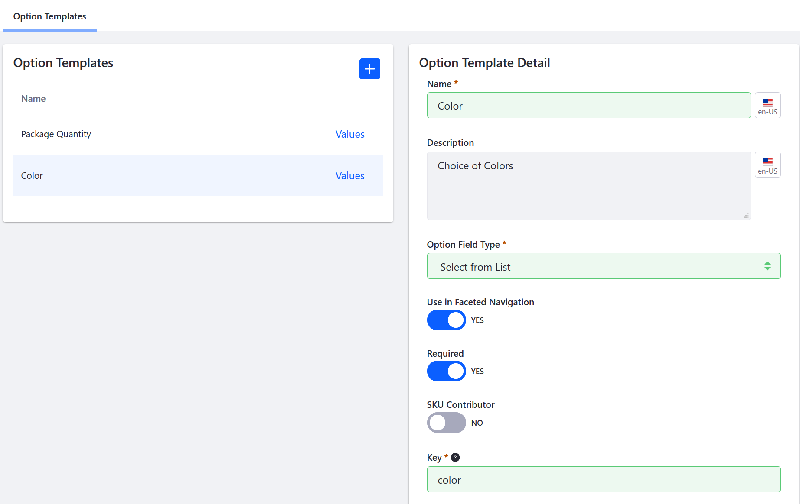
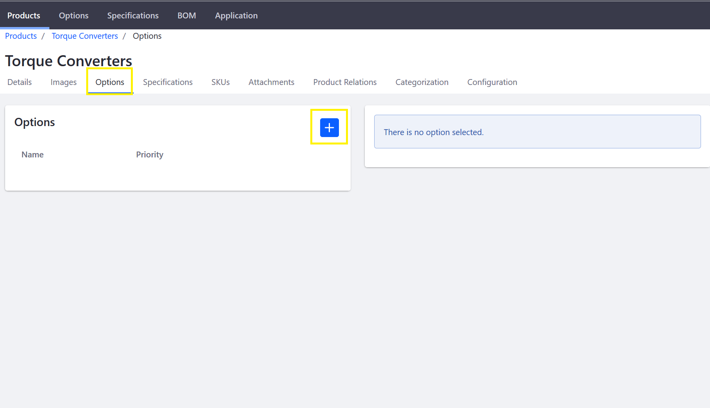
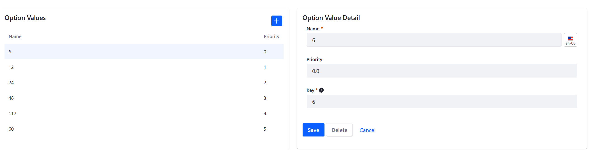

# Customizing Your Product with Product Options

Adding customizable options in Liferay Commerce is an easy way to offer customers a variety of options for each product such as size, quantity, and color. 

Before applying an option to a product, it is _necessary_ to create an option template first.

An option template can be applied to any product in the catalog. This makes it easy to apply frequently-used options to a large number of products. This article describes how to create an option template. Option Templates are created independently from a product so that changes to the template do not affect the product's description. 

## Roadmap

* Creating an Option Template
* Adding Option Values
* Applying an Option Template to a Product

### Creating an Option Template

To create an option template:   

1. Navigate to the _Control Panel_ → _Commerce_ → _Product_.      
1. Click on the _Options_ tab. This displays a list of existing templates on the left of the page and the _Option Template Detail_ form on the right.
1. Click the (+) to add an Option Template.
1. Enter the following:
    * **Title**: Color
    * **Description**: Choice of colors
    * **Field Type**: Select from List
    * **Use in Faceted Navigation**: Yes
	* **Required**: Yes
	* **SKU Contributor:** No
	* **Key**: (automatically generated)

    

1. Click _Save_. 

The Option Template has been added and can be applied to all products.

**Note 1**: When _Use in Faceted Navigation_ is switched to _Active_, this enable to allow search results to be filtered for this option.

**Note 2**: A SKU contributor can be assigned a unique price and other attributes for each variant via [SKUs](https://help.liferay.com/hc/en-us/articles/360017869972-SKUs-). If enabled, the option must have an SKU in order to be sold.

### Adding Option Values

Depending on the Field Type used in the template, you may need to create values for that option. In this example, _Select from List_ requires Option Values, such as the different product colors.

To add multiple Option Values:

1. Click the _Values_ link next to _Color_.
1. Click the (+) Add Option Values button.
1. Enter the following:
    * **Name:** Black
    * **Priority:** 1.0
    * **Key:** (autogenerated from the _Name_ field)

        

1. Click _Save_. 

_Black_ is now added to the Color options. To add more colors, repeat the steps and increment up the priority. For example, you can add _White_ and priority set as 2.0 followed by _Blue_ with priority 3.0, and so forth. Remember the priority field determines the order in which the options are displayed with the lowest values being displayed first.

### Applying an Option Template to a Product

Once you apply a template to a product, you can make any changes to the product's option. These changes will not affect the option template or any other product.

To apply an option template to a product:

1. Navigate to the _Control Panel_ → _Commerce_ → _Products_.
1. Click the _Products_ tab.
1. Click on any product listed there. For example, if the Minium.com accelerator was used to create the site, one sample product is the _Torque Converters_.

     

1. Click _Torque Converters_.
1. Click the _Options_ tab.

    

1. Click the (+) button to add an Option.
1. Check the box for _Package Quantity_.
1. Enter **1.0** in the _Priority_ field.

    

1. Click _Save_.

The Option Template is now applied; when the product is displayed on the catalog page, buyers can select different quantities for Torque Converters. 

## Additional Information

Note that you can apply more than one option template per product and each option has its own unique display priority. In addition to _Package Quantity_ (created by default in the Minium accelerator), there is the _Color_ Option created in the Options Template section above.
Furthemore, you can change the Option Values on this screen without having to change the template itself. 

1. Click the _Values_ link next to _Package Quantity_.
2. Click the (+) button to add a new value.
3. Enter the following:
    * **Name:** 60
    * **Priority:** 5.0
    * **Key:** (autogenerated)
4. Click _Save_. 
    

The new option has been added to the possible quantities a buyer can choose from.