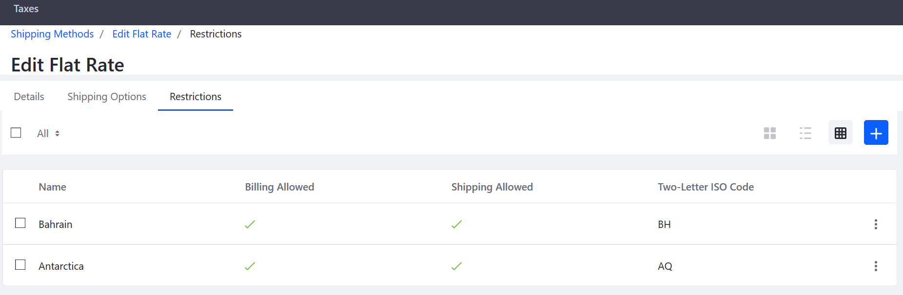

# Applying Restrictions to Shipping Methods 

Depending on legal or practice reasons, you can apply a shipping restriction for your store to specific countries or regions. This means these countries are not available during the checkout process. These restrictions apply to all shipping options for a particular shipping method; in other words, restrictions applied in the _Flat Rate_ are not copied in _Variable Rates_. 

To apply a restriction:

1. Navigate to the _Control Panel_ → _(your store)_ → _Commerce_ → _Settings_. 
1. Click the _Shipping Methods_ tab.
1. Click any Shipping Method; in this example, _Flat Rate_.
1. Click the _Restrictions_ tab.
1. Click the (+) button to add a new restriction.
1. Check all the boxes for countries where you do not want to ship to; in this example; Antartica and Bahrain.
1. Click _Add_.

    

Your store is now restricted from shipping to those countries. Repeat these steps for all the other shipping methods such as _Variable Rate_ and _FedEx_. If you are customizing Liferay Commerce by adding additional carrier shipping methods (UPS, DHL, and so forth) through an extension point, you may want to include the same function to restrict delivery by region.

## Additional Information

* [Flat Rate Shipping]()
* [Variable Rate]()