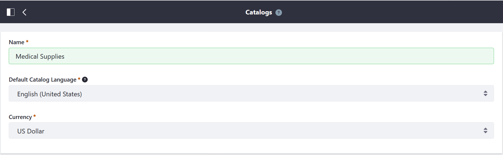

# Creating a Catalog

A catalog is the complete list of related products that can be displayed on a store site. Multiple catalogs may be created and associated with [channels](../catalog/introduction-to-channels.md).

To create a new catalog:

1. Navigate to _Control Panel_ → _Commerce_ → _Catalogs_.
1. Click the (+) button to add a new catalog.
1. Enter the following:
    * **Name**: Medical Supplies
    * **Default Catalog Language**: (your Language) (for example, _English (United States)_)
    * **Currency**: (your store's currency) (_US Dollar_)

    

1. Click _Save_.

The new catalog has been created and will be selectable when adding a new product.

## Additional Information

* [Locale Options](../getting-started/locale-options.md)
* [Adding a New Currency](../getting-started/adding-a-new-currency.md)
