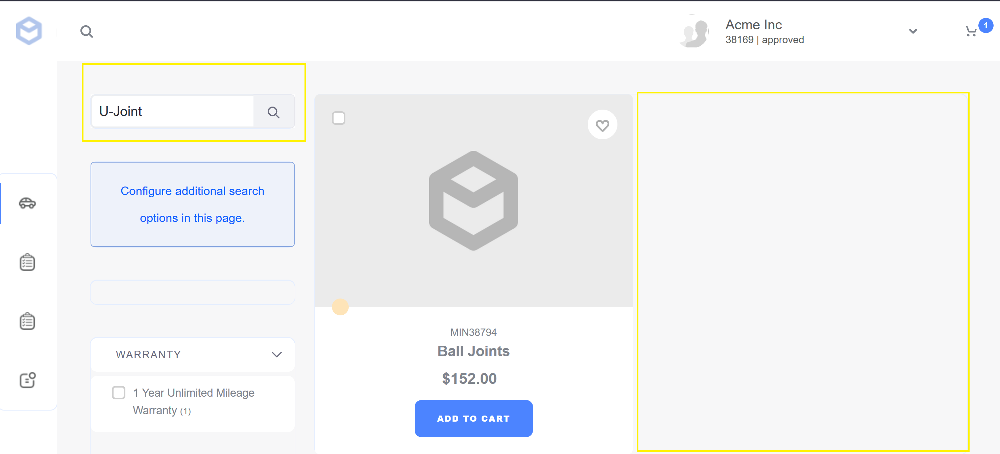

# Managing Product Publication

Liferay Commerce allows store managers to configure a publication schedule that determines when a product is available for purchase. An expiration date can also be configured to determine when a product is no longer available for sale. When a product expires it is placed in an _Expired_ status and is not visible in search results for the store.

Unpublishing a product sets the product to a _Draft_ status, keeps the product in the database, and removes the product from search results. Unpublishing a product can be configured to happen automatically if the product's inventory falls below a minimum threshold; for more information, see the article on [Low Stock Activity](./low-stock-activity.md).

## Scheduling Product Expiration

Scheduling product expiration is accomplished through the _Control Panel_. To schedule product expiration:

1. Navigate to _Control Panel_ → _Commerce_ → _Products_.
1. Click on a product (for example, _U-Joint_).
1. Uncheck the _Never Expire_ checkbox.
1. Enter an expiration date and time.

    

1. Click _Publish_.

After the expiration date, the product will be not returned when searching on the _Catalog_ page. The product can be made visible again by entering a new expiration date and republishing the product.

## Unpublishing a Product

1. Navigate to _Control Panel_ → _Commerce_ → _Products_.
1. Click on a product (for example, _U-Joint_).
    > Expand the _Schedule_ section if necessary.
1. Uncheck the _Published_ checkbox.
    

1. Click _Publish_.
1. Navigate to the store site.
1. Search for the product (_U-Joint_ in this example).

The product is not searchable in the catalog.

## Additional Information

* [Introduction to Product Types](./introduction-to-product-types.md)
* [Creating a Simple Product](./creating-a-simple-product.md)
* [Creating a Grouped Product](./creating-a-grouped-product.md)
* [Creating a Virtual Product](./creating-a-virtual-product.md)
* [Low Stock Activity](./low-stock-activity.md)