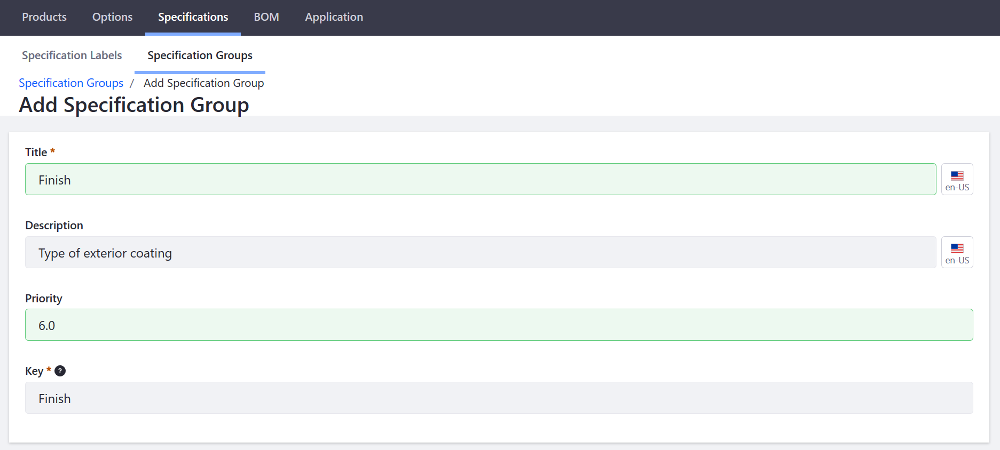

# Specifications

A specification stores a single piece of product information. A product’s dimensions, color, weight, capacity, or almost any other attribute can be recorded as a specification. Specifications make it easy to present product information and simplify the process of comparing similar products.

To organize specifications and make them easy to display and maintain, specification data is ordered into one of three components: groups, labels, and values.

| Name | Description |
| --- | --- |
| [Specification Group](#specification-groups) | Specifications with common characteristics can be organized into a group. |
| [Specification Label](#specification-labels) | Names a specification. |
| [Specification Value](#specification-values) | Provides product-specific information. |

## Specification Groups

1. Navigate to the _Control Panel_ → _Commerce_ → _Products_.
1. Click the _Specifications_ tab.
1. Click the _Specification Groups_ sub-tab. By default, there are five Specification Groups included:

    

To add a new Specification Group, click the (+) button.

| Field | Description |
| --- | --- |
| Title | Name of the Specification Group. |
| Description | Explanation of what the specifications have in common |
| Priority | Establishes the order to display the specification groups. Smaller numbers go first. |
| Key | A unique identifier for referring to this group programmatically. |

## Specification Labels

To create a specification label:

1. Navigate to the _Control Panel_ → _Commerce_ → _Products_.
1. Click the _Specifications_ tab.
1. Click the _Specifications Labels_ sub-tab.
1. There are nine Specification Labels included by default:

    

To add a new Specification Group, click the (+) button.

| Field | Description |
| --- | --- |
| Label | Name of the Label. |
| Description | Explanation of the label. |
| Use in Faceted Navigation | Toggle whether this label is used in faceted navigation. |
| Default Specification Group | Dropdown menu for which group this label is to be associated. |
| Key | A unique identifier for referring to this group programmatically. |

The label has been created, but assigning a value to it must be done on the product level.

## Specification Values

 Specification values are more limited in scope than groups and labels. Groups and labels are scoped to the catalog, which means that once they are created, they can be assigned to any product in the catalog. Values, however, are scoped to the product, and have no impact anywhere but on the product to which they are assigned.

 To create a specification label, you must first assign a label to a product.

1. Navigate to the _Control Panel_ → _Commerce_ → _Products_.
1. Click on a product (for example, _Torque Converter_. This sample product is added when using the Minium accelerator.)
1. Click on the _Specifications_ sub-tab.
1. The following values have been added by default:

    

1. Click the (+) button.
1. Check the boxes for one or more specification labels from the list of specification labels.
1. Click _Add_ to close the pop-up.

This assigns the selected labels to the product.

Next, edit the label to give it a value.

1. Click on the 3-dot icon next to the new label.
1. Click _Edit_.

|Field | Description |
|----- | --------- |
|Value | Short description of what the product is made of |
|Group | Dropdown menu for which Specification Group. | 
|Priority | Establishes the order to display the specification groups. Smallest numbers go first. |

You can also override the specification group that was selected when the label was created. When editing the label to assign a value, you can choose any group from the _Group_ drop-down box. This change applies only to the current product and has no effect on any other products which use the same label.
