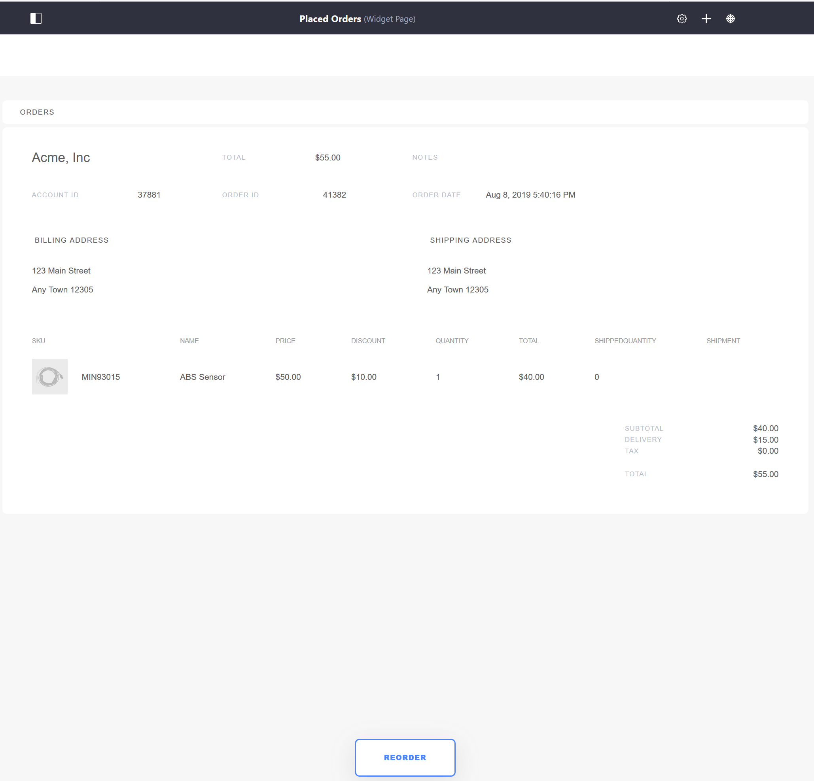

# Placed Orders

The Placed Orders page is a required page that displays all orders that have completed the checkout process per **account** regardless of order status. The page uses the _Orders_ widget.

If using the [Minium Accelerator](../getting-started/using-the-minium-accelerator-to-jump-start-your-b2b-store.md) to create sample data, the _Placed Order_ page has already been created and can be found in the site Navigation Menu.

The widget lists all orders associated with a particular account.

Individual order summaries may be viewed by clicking the related Order ID link. The _Reorder_ button allows buyers to order the item without having to browse through the catalog again.

## Additional Information

* [Widget Reference Guide](../content/widget-reference.md)
* [Creating Pages](https://help.liferay.com/hc/en-us/articles/360018171291-Creating-Pages)
* [Minium Accelerator](../getting-started/using-the-minium-accelerator-to-jump-start-your-b2b-store.md)
