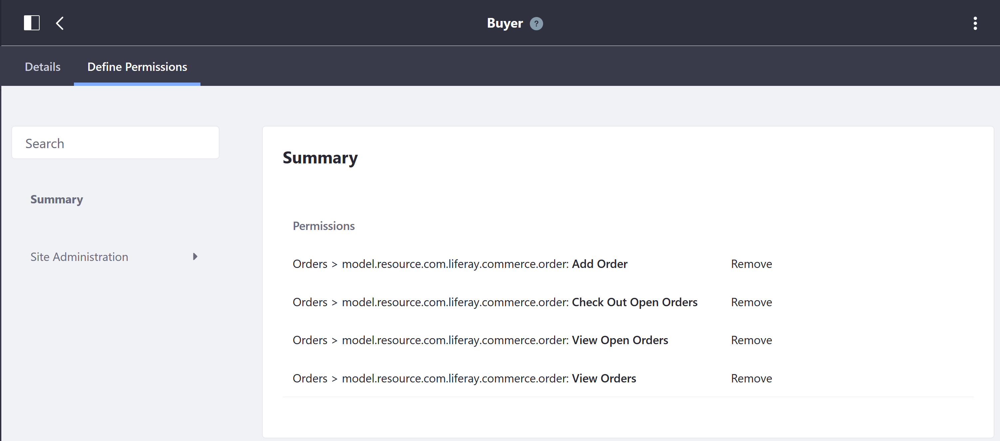

# Buyer Permissions Reference

Users assigned this role can view, create, and check out orders. The following permissions have been assigned to the Buyer role. These permissions are the minimum. Although they can be removed, this will cause some changes in user access and abilities to make transactions on the Commerce site. However, more permissions may be _added_.

To view the permissions:

1. Navigate to the _Control Panel_ > _Users_ > _Roles_.
1. Click the _Site Roles_ tab.
1. Click _Buyer_.
1. Click the _Define Permissions_ tab.

There are four permissions set by default:

| Permissions | Description |
| --- | --- |
| Add Order | Ability to add an order to the Buyer's specified account (can have more than one account) |
| Checkout Open Orders | Ability to complete the checkout process for new, incomplete orders |
| View Open Orders | Ability to view all open orders |
| View Orders | Ability to view all orders regardless of their statuses |

New permissions can added by clicking the _Site Administration_ in the left navigation.

## Site Administration  > Commerce

Additional Commerce-specific permissions for Wish Lists and Commerce Settings are found in the following places. Granting permissions allow Buyers to perform additional functionalities or view administrative aspects of the platform.

* Wish Lists
* Settings

## Site Administration > Applications

* Accounts
* Cart
* Cart Summary
* Checkout
* Commerce Addresses
* Commerce BOM
* Commerce Categories Navigation
* Coupon Code Entry
* Dashboard Forecasts Chart
* Mini Cart
* Open Carts
* Option Facet
* Orders
* Shipments
* Specification Facet
* Wish List Contents
* Wish Lists

## Additional Information

To see how the other permissions are used by higher level roles, see the following:

* [Sales Agent Permissions](./sales-agent-permissions.md)
* [Order Manager Permissions](./order-manager-permissions.md)
* [Account Administrator Permissions](./account-administrator-permissions.md)
