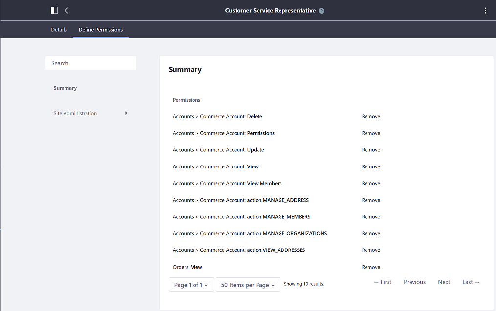
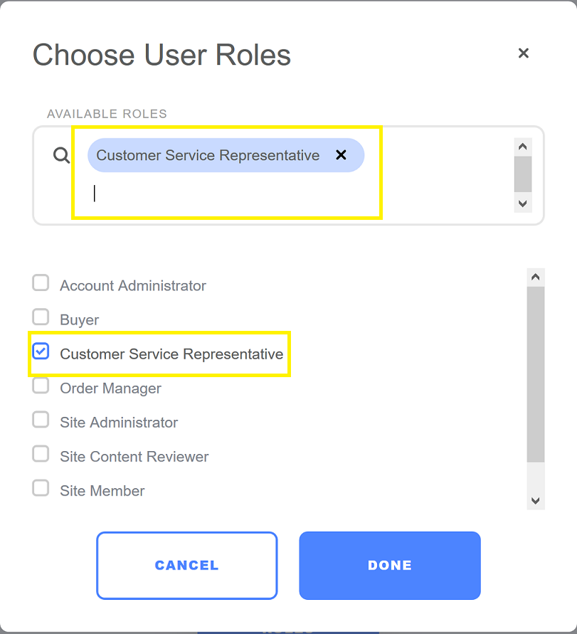

# Creating a Custom Account Role

Liferay Commerce offers four account roles by default: [Account Administrator](./account-administrator-permissions-reference.md), [Buyer](./buyer-permissions-reference.md), [Order Manager](./order-manager-permissions-reference.md), and [Sales Agent](./sales-agent-permissions-reference.md). If a store administrator determines that none of the existing roles are sufficient for particular needs, administrators can create a new role. Before creating a custom account role, review the permissions keys associated with the four account roles first. As always, store administrators can add more permissions to each account role.

To add a new account role:

1. Navigate to the _Control Panel_ → _Users_ → _Roles_.
1. Click the _Site Roles_ tab.
1. Click the _Add Site Role_ button.
1. Enter the following:
    * **Name**: Customer Service Representative.
1. Click _Save_.
1. Click _Define Permissions_.
1. Select the Commerce permissions from the _Site Administration_ in the left menu.

    

1. Click _Save_.

Once the new role has been created, it will be listed in the _Site Roles_ menu in the Control Panel and also the _Account Management_ widget.

## Additional Information

* [Roles and Permissions](https://help.liferay.com/hc/articles/360017895212-Roles-and-Permissions)
* [Account Roles](./account-roles.md)
