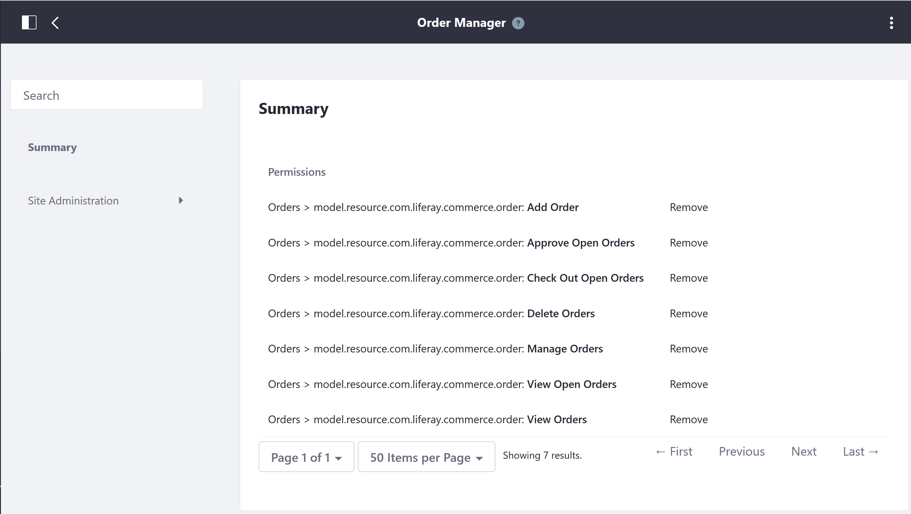

# Order Manager Permissions Reference

Order Managers have all the permissions of buyers, and can also manage, delete and approve orders. The following permissions have been assigned to the Order Manager role. These permissions are the minimum. Although they can be removed, this will cause some changes in user access and abilities to make transactions on the Commerce site. However, more permissions may be _added_.

To view the permissions:

1. Navigate to the _Control Panel_ → _Users_ → _Roles_.
1. Click the _Site Roles_ tab.
1. Click _Order Manager_.
1. Click the _Define Permissions_ tab.

To add more permissions, click the left navigation menu and select the new permissions for this role.

The following permissions are set by default:

| Permissions | Description |
| --- | --- |
| Add Order | Allows order managers to add an order |
| Approve Open Orders | Allow order managers to approve orders if workflow has been enabled |
| Check Out Open Orders | Ability to complete the checkout process for new, incomplete orders |
| Delete Orders | Allow order managers to delete orders |
| Manage Orders | Change Order details such as mailing and billing addresses; ability to add a note to the order |
| View Open Orders | Ability to view all open orders |
| View Orders | Ability to view all orders regardless of their statuses |

New permissions can added by clicking the _Site Administration_ in the left navigation.

## Site Administration → Commerce

Additional Commerce-specific permissions for Wish Lists and Commerce Settings are found in the following places. Granting permissions allow Buyers to perform additional functionalities or view administrative aspects of the platform.

* Wish Lists
* Settings

## Site Administration → Applications

* Accounts
* Cart
* Cart Summary
* Checkout
* Commerce Addresses
* Commerce BOM
* Commerce Categories Navigation
* Coupon Code Entry
* Dashboard Forecasts Chart
* Mini Cart
* Open Carts
* Option Facet
* Orders
* Shipments
* Specification Facet
* Wish List Contents
* Wish Lists

## Additional Information

* [Account Roles](./account-roles.md)
* [Account Administrator Permissions Reference](./account-administrator-permissions-reference.md)
* [Buyer Permissions Reference](./buyer-permissions-reference.md)
* [Sales Agent Permissions Reference](./sales-agent-permissions-reference.md)
