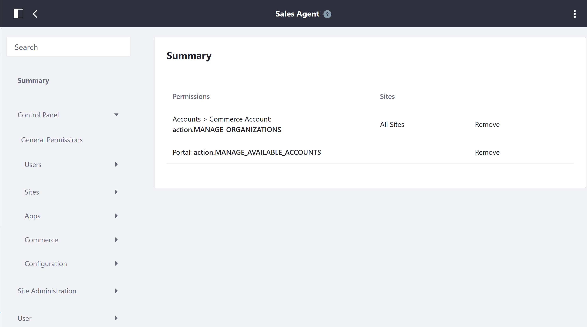

# Sales Agent Permissions Reference

The Sales Agent is a regular role in Liferay Commerce and assignees are able to manage any account assigned to the role without granting administrative permissions. The following permissions have been assigned to the Sales Agent role. These permissions are the minimum. Although they can be removed, this will cause some changes in user access and abilities to make transactions on the Commerce site. However, more permissions may be _added_.

To view the permissions:

1. Navigate to the _Control Panel_ → _Users_ → _Roles_.
1. Click the _Regular Roles_ tab.
1. Click _Sales Agent_.
1. Click the _Define Permissions_ tab.

| Permissions | Description |
| --- | --- |
| Manage Organizations | Ability to add or remove organizations |
| Manage Available Accounts | Ability to manage accounts that the sales agent is a member of |

To add more permissions, click the left navigation menu and select the new permissions for this role.

New permissions can added by clicking the _Site Administration_ in the left navigation.

## Site Administration → Commerce

Additional Commerce-specific permissions for Wish Lists and Commerce Settings are found in the following places. Granting permissions allow Buyers to perform additional functionalities or view administrative aspects of the platform.

* Wish Lists
* Settings

## Site Administration → Applications

* Accounts
* Cart
* Cart Summary
* Checkout
* Commerce Addresses
* Commerce BOM
* Commerce Categories Navigation
* Coupon Code Entry
* Dashboard Forecasts Chart
* Mini Cart
* Open Carts
* Option Facet
* Orders
* Shipments
* Specification Facet
* Wish List Contents
* Wish Lists

## Additional Information

To see how the other permissions are used by higher level roles, see the following:

* [Order Manager Permissions Reference](./order-manager-permissions-reference.md)
* [Account Administrator Permissions Reference](./account-administrator-permissions-reference.md)
* [Account Roles](./account-roles.md)
* [Roles and Permissions](https://help.liferay.com/hc/articles/360017895212-Roles-and-Permissions)
