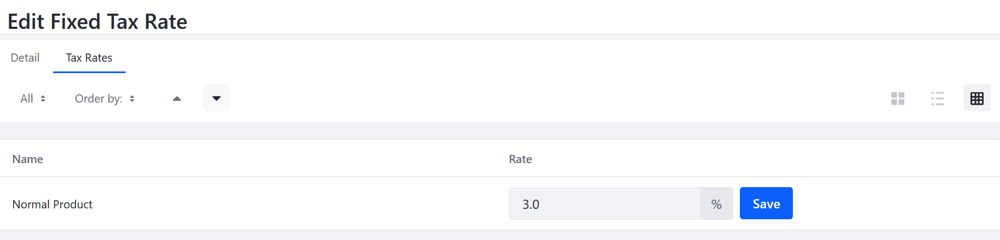

# Setting a Fixed Tax Rate

Liferay Commerce supports two types of tax calculations: fixed and by address. The fixed method applies the same rate to a product each time it is purchased, while the by address method applies only to buyers within a specified geographical region.

A fixed tax method sets rates for each tax category independently. The tax collected then depends on the tax category assigned to a product.

First, enable the _Fixed Tax Rate_ function:

1. Go to _Site Administration_ → _Commerce_ → _Settings_.
1. Click the _Taxes_ tab and then the _Tax Calculations_ sub-tab.
1. Click on _Fixed Tax Rate_.
1. Switch the _Percentage_ toggle to _YES_ if the tax should be defined as a percentage of the purchase price. Disable to define the tax as a fixed amount.
1. Switch the toggle to _YES_.

    

1. Click _Save_.

Next, set the tax rate for the tax category:

1. Click the _Tax Rates_ sub-tab.
1. Enter the tax rate in the _Rate_ field for each tax category.

    

1. Click _Save_.

Your store will now collect a fixed rate for all orders that fall under this tax category.

## Additional Information

* [Setting Tax Rates by Address](../operations/setting-tax-rate-by-address.md)
* [Creating Tax Categories](../operations/creating-tax-categories.md)
